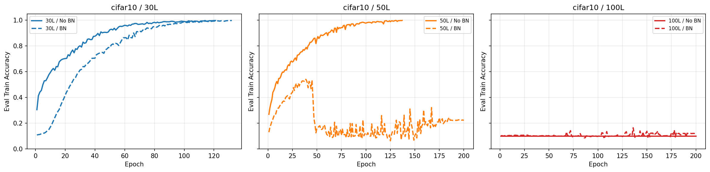
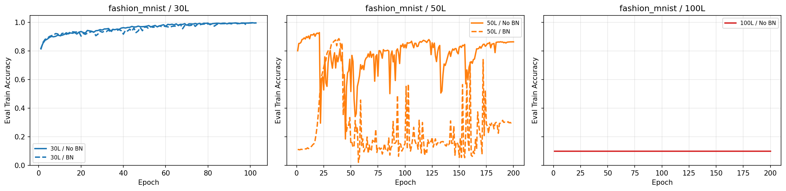

# 02 — He Tuning Sweep (Apr 11 – May 3, 2026)

**Question.** Can plain He initialization *memorize* — `eval_train_accuracy ≥ 0.995` and `eval_train_loss ≤ 0.10` (full train set, eval mode) — on all 12 architectures ({Fashion-MNIST, CIFAR-10} × {30, 50, 100} layers × {BN, NoBN}, FC width 500), once every architecture gets its own tuned recipe?

**Builds on.** Campaign [01](../01_geometry/README.md) showed row-centering loses class structure at depth; before judging any alternative initializer on *training*, this campaign establishes what He itself can and cannot do. The untuned baseline inside this campaign (single fixed recipe: Adam 1e-3, no scheduler, bs 128, 120 epochs) fails **0/12** — motivating the per-architecture sweep.

## What ran

A three-stage pipeline, all with `he` init and no gradient clipping:

1. **Baseline grid** (`fnn_he_fashion_cifar_train.sub` → `fnn_he_bn_evaltrain_training.json`): one fixed recipe over all 12 cells.
2. **Stage-1 HP sweeps** (`fnn_he_tuning_{nobn_stage1,bn_stage1_fmnist,bn_stage1_cifar10}.sub` + `*_remaining.sub`): NoBN grid {Adam 3e-4/1e-3, SGD 1e-2/3e-2 mom 0.9} × {none, cosine, onecycle} × bs 128; BN grid {Adam 1e-3/3e-3, SGD 3e-2/1e-1} × {cosine, onecycle} × bs {128, 256} × bn_momentum {0.1, 0.05}. 60 epochs, early stop.
3. **Targeted rerun** (`fnn_he_targeted_best12.sub` → `fnn_he_targeted_best12.json`): the 12 winning recipes at 200 epochs. Winners: 30/50L NoBN → SGD 0.01 + onecycle; 30/50L BN → Adam 1e-3 + cosine/onecycle bs 256; 100L → Adam 1e-3 (cosine; the fmnist/100L/BN config used onecycle).

Side grids `supervised_comparison.sub` / `supervised_product_balanced.sub` (fixed recipe, no target) compare He against row-centered variants — early V1-era comparisons, not part of the pass/fail pipeline.

## Findings — 5/12 PASS




From `fnn_he_targeted_best12.json` (best-epoch values):

| Cell | Outcome |
|---|---|
| All four 30L (both datasets, BN & NoBN) | **PASS** (e.g. cifar10/30L/NoBN 0.9974 @ ep121) |
| cifar10/50L/NoBN | **PASS** (0.9981 @ ep137) |
| fmnist/50L/NoBN | FAIL — best 0.9291 @ ep21, *despite the identical recipe passing on CIFAR-10* |
| Both 50L/BN | FAIL — learn to ~0.54/0.89 mid-run, then **late BN collapse** (final acc 0.22/0.30) |
| 100L NoBN (both) | FAIL — flat at chance (exactly 0.1000/2.3026 for 200 epochs); no NaN, gradients dead |
| cifar10/100L/BN | FAIL — best 0.164, drifts down |
| fmnist/100L/BN | **no result recorded** — 12th run never finished before the 12h wall (configs file has 12 entries, results 11) |

Takeaways that drive the next campaigns: (a) tuning is worth 5 cells over the untuned 0/12; (b) two distinct 100L failure modes — NoBN = frozen at chance, BN = brief learning then collapse; (c) the depth ceiling is dataset-dependent at 50L.

## Reproduce

```bash
cd ~/thesis
sbatch cluster/02_he_tuning/fnn_he_fashion_cifar_train.sub    # baseline, ~18h
sbatch cluster/02_he_tuning/fnn_he_tuning_nobn_stage1.sub     # sweeps support --resume; resubmit on timeout
sbatch cluster/02_he_tuning/fnn_he_tuning_bn_stage1_fmnist.sub
sbatch cluster/02_he_tuning/fnn_he_tuning_bn_stage1_cifar10.sub
sbatch cluster/02_he_tuning/fnn_he_targeted_best12.sub        # needs fnn_he_targeted_best12_configs.json; budget >12h
```

Outputs land incrementally in `reports/results/` (one entry per completed run) — a wall-timeout leaves a valid prefix, as happened to run 12.

## Evidence & gaps

- Results: `fnn_he_targeted_best12{,_configs}.json`, `fnn_he_bn_evaltrain_training.json`; figures in `reports/figures/he_tuning/` (11 files).
- **Gaps:** intermediate stage-1 sweep JSONs (`*_sweep.json`, `*_best.json`) were not retained locally, so the winner-selection trail is inferred from `.sub` wiring; `fnn_he_bn_training.json` is an older pre-`eval_train` duplicate of the baseline (criterion not computable from it); no SLURM logs for this campaign.
