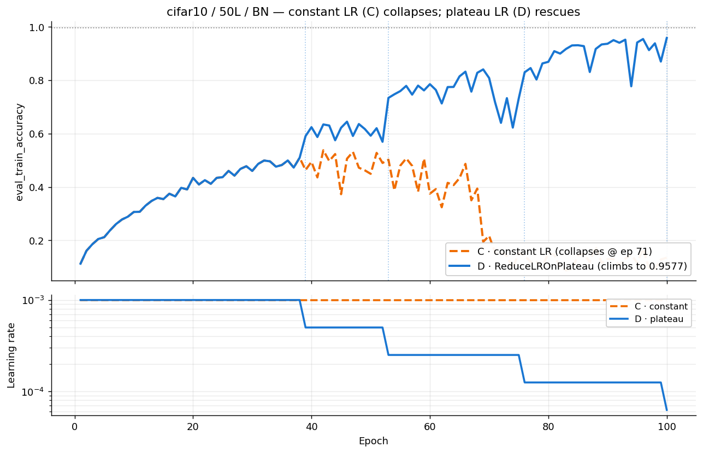
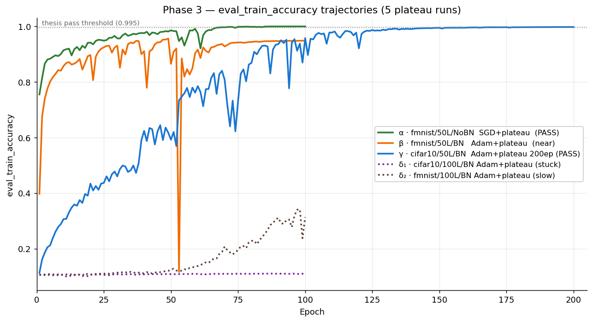

# 03 — He Diagnostics, Phases 1–5 (May 14–16, 2026)

**Question.** *Why* do the 7 architectures that failed the tuned-He sweep fail — and what recipe rescues each? Iterative hypothesis testing: run short, inspect gradient norms / BN statistics / LR schedules, form a hypothesis, adjust, repeat.

**Builds on.** Campaign [02](../02_he_tuning/README.md)'s failures, quoted directly in `run_diagnostic.py`'s comments ("Original: SGD+OneCycle lr=0.01 → crash at epoch 22 when LR ramps up"; "Adam+Cosine, bn_m=0.05 → collapse at epoch ~40"). All later phases share helpers from `run_diagnostic.py`, and each phase's docstring cites the previous phase's measured numbers.

## What ran (all `he`, FC width 500, no clipping)

| Phase | Runner | Experiments | Design |
|---|---|---|---|
| 1 (30 ep) | `run_diagnostic.py` | 7 | Hypotheses: LR overshoot, BN-stats drift, gradient death |
| 2 (100 ep) | `run_phase2.py` | 7 | Extend Phase-1 winners + the **constant-LR vs ReduceLROnPlateau A/B** |
| 3 (100–200 ep) | `run_phase3.py` | 5 | Apply the plateau lesson to all still-failing architectures |
| 4 (200 ep) | `run_phase4.py` | 3 | Gentler plateau + warmup — **never run** (no JSON, no log) |
| 5 (100 ep) | `run_phase5.py` | 1 | One final shot at fmnist/50L/BN with halved LR |

## Findings — three rescues and two walls



**The pivotal result (Phase 2, C vs D):** on cifar10/50L/BN, the constant-LR control learns to 0.537 then *collapses* to 0.136, while the identical run under `ReduceLROnPlateau` climbs monotonically to 0.958. The mid-training BN collapse seen throughout campaign 02 is an LR-schedule disease, and plateau scheduling is the cure.



Applying that lesson (from `diagnostic_phase{1,2,3,5}.json`):

| Architecture | Recipe | Outcome |
|---|---|---|
| fmnist/50L/NoBN (α) | SGD 3e-3 + plateau | **PASS** 0.9997 @ ep100 |
| cifar10/50L/BN (γ) | Adam 1e-3 + plateau, bn_m 0.01, 200 ep | **PASS** 0.9977 @ ep198 |
| fmnist/50L/BN (ε′, Phase 5) | Adam **5e-4** + plateau | **PASS** 0.9996 @ ep96 (plain plateau at 1e-3 had stalled at 0.949 with loss spikes up to 21.8) |
| cifar10/100L/BN (δ1) | Adam + plateau | FAIL — 0.110, LR floored at 1e-6, plateau does not unstick it |
| fmnist/100L/BN (δ2) | Adam + plateau | FAIL — 0.342 partial late breakthrough |
| 100L/NoBN (both, Hyp G) | — | **Gradient death, literally**: per-layer grad norms are `min=max=0.00` across all 100 layers from epoch 3 onward |

Net effect: He goes from 5/12 to **8/12** (confirmed at 200 epochs in campaign [04](../04_he_final_audit/README.md)). The two walls identified here — 100L/NoBN gradient death and the 100L/BN stall — are attacked in campaign [05](../05_sgd_recovery/README.md).

## Reproduce

```bash
cd ~/thesis
sbatch cluster/03_he_diagnostics/fnn_he_diagnostic_phase1.sub   # 4h
sbatch cluster/03_he_diagnostics/fnn_he_diagnostic_phase2.sub   # 8h
sbatch cluster/03_he_diagnostics/fnn_he_diagnostic_phase3.sub   # 6h
sbatch cluster/03_he_diagnostics/fnn_he_diagnostic_phase5.sub   # 1h
```

Expect `reports/results/diagnostic_phase<N>.json` — one entry per experiment with `hypothesis_label` and full per-epoch history including `grad_norm_per_layer` and BN running stats; checkpoints every 10/25/25/25 epochs (p1/p2/p3/p5); stdout ends with a per-phase summary table. Experiment subsets via `--experiments <labels>` (phases 1–4; phase 5 is a single run).

## Evidence & gaps

- Results: `diagnostic_phase{1,2,3,5}.json`; figures in `reports/figures/diagnostic_phases/` (10, phases 1–3); logs in `logs/slurm/03_he_diagnostics/`.
- **Gaps:** Phase 4 (`run_phase4.py` — including the ζ warmup attempts on 100L/BN) was prepared but never executed, so whether warmup helps 100L/BN was not tested here; no figures exist for Phase 5.
