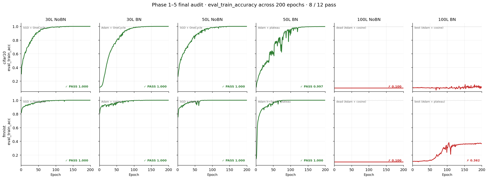
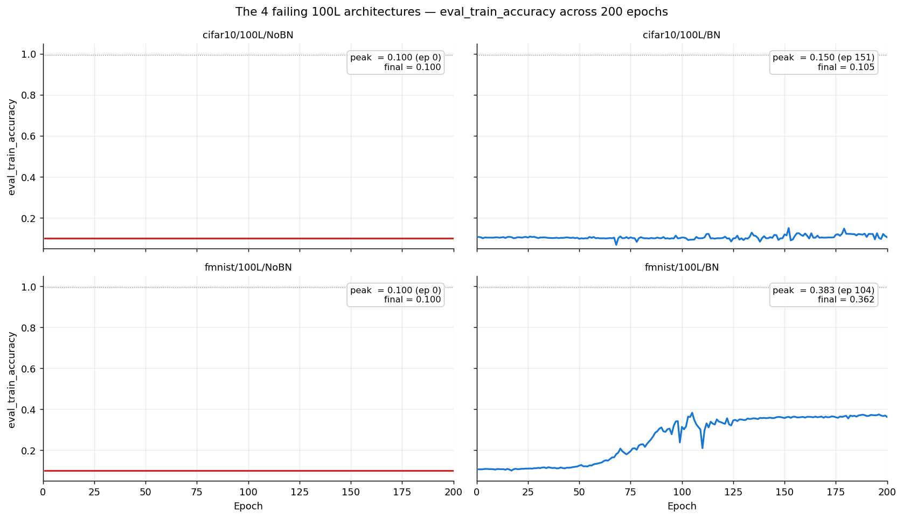

# 04 — He Final Audit (May 16–18, 2026)

**Question.** With every architecture running its best-known recipe under one uniform budget (seed 42, 200 epochs, no early stopping, per-epoch logging) — what does He initialization *actually* train, and where does it fail?

**Builds on.** The recipes are the collected winners of campaigns [02](../02_he_tuning/README.md) and [03](../03_he_diagnostics/README.md) — `run_final.py`'s docstring attributes each of the 12 recipes to its source (original sweep, Phase 1 #7, Phase 2 E/G, Phase 3 α/γ/δ2, Phase 5 ε′).

## What ran

One runner, `run_final.py`, all 12 architectures (`he`, FC width 500, no clipping, checkpoints every 50 epochs). Notable per-cell recipes: 30/50L NoBN → SGD onecycle (lr 0.01, fmnist/50L: 0.003 + plateau); 50L BN → Adam + **plateau** (the Phase-2 lesson); fmnist/50L/BN → Adam **5e-4** + plateau (Phase 5); 100L → Adam cosine/plateau. The 12h base job (`fnn_he_final.sub`) completed 10 runs before the wall; `fnn_he_final_continuation.sub` finished the two fmnist/100L cells. `final_audit_merged.json` = both files merged (verified element-identical).

## Findings — 8/12 PASS, and the 100L wall in full view



From `final_audit_merged.json` (all runs 200/200 epochs, no NaN anywhere):

| Cell | Best (epoch) | Final | Verdict |
|---|---|---|---|
| cifar10/30L NoBN · BN | 1.0000 (144) · 1.0000 (170) | 1.0000 · 1.0000 | **PASS** |
| fmnist/30L NoBN · BN | 1.0000 (134) · 0.9999 (172) | 1.0000 · 0.9999 | **PASS** |
| cifar10/50L NoBN · BN | 1.0000 (158) · 0.9977 (198) | 1.0000 · 0.9974 | **PASS** |
| fmnist/50L NoBN · BN | 1.0000 (173) · 1.0000 (156) | 1.0000 · 1.0000 | **PASS** |
| cifar10/100L NoBN | 0.1000 (1) | 0.1000 | FAIL — chance, per-layer grads identically **0.0** |
| fmnist/100L NoBN | 0.1000 (1) | 0.1000 | FAIL — same gradient death |
| cifar10/100L BN | 0.1500 (152) | 0.1049 | FAIL — never learns |
| fmnist/100L BN | 0.3825 (105) | 0.3618 | FAIL — peaks at 38%, regresses |



The headline: **the diagnostic recipes work everywhere except depth 100.** Both 50L/BN cells that used to collapse mid-training now pass cleanly under plateau scheduling. The four 100L failures split into the two modes campaign 03 identified — NoBN dies (gradients exactly zero from the first epochs), BN partially learns then slides back. Campaign [05](../05_sgd_recovery/README.md) attacks exactly these four cells.

## Reproduce

```bash
cd ~/thesis
sbatch cluster/04_he_final_audit/fnn_he_final.sub                # 12h wall covers ~10 of 12 runs
sbatch cluster/04_he_final_audit/fnn_he_final_continuation.sub   # the two fmnist/100L cells, 3h
# then merge: final_audit.json (10) + final_audit_continuation.json (2) -> final_audit_merged.json
```

Expect incremental writes to `reports/results/final_audit*.json` (an entry per completed run, so a timeout leaves a valid prefix); stdout ends with a `FINAL AUDIT SUMMARY` block. Budget ~13–15h total for a clean rerun.

## Evidence & gaps

- Results: `final_audit{,_continuation,_merged}.json`; figures in `reports/figures/final_audit/` (11 for this campaign — the four `final_v2_*.png` there belong to campaign [06](../06_v2_row_centered/README.md)'s comparison); logs in `logs/slurm/04_he_final_audit/`.
- **Gaps:** no merge script was preserved (the merged file was verified against its parts instead); the figure-generating notebook/script isn't recorded in this dir (`notebooks/13_final_results.ipynb` is the analysis companion).
