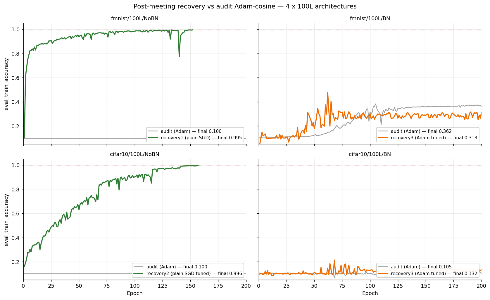

# 05 — Plain-SGD Recovery (May 22–23, 2026)

**Question.** The advisor trains a 100-layer net with the plainest possible recipe (He, SGD lr=1e-3, no momentum, no weight decay). Does that recipe reproduce here — and can it rescue the four 100L architectures the final audit left failing?

**Builds on.** Campaign [04](../04_he_final_audit/README.md)'s four 100L failures (quoted in the runners' docstrings: "Adam-cosine died, loss stuck at 2.3026"). The trigger was the advisor's reported run ("Epoch 5: Train 75.40%, Test 77.40%") — quoted in `run_plain_sgd_100L.py`.

## What ran (all `he`, seed 42)

| Round | Runner | Recipe delta | Cells |
|---|---|---|---|
| Replication | `run_plain_sgd_100L.py` | Advisor's recipe verbatim: SGD 1e-3, mom 0, wd 0, w512, 20 ep | {mnist, fmnist, cifar10} × 100L NoBN |
| 1 | `run_plain_sgd_recovery.py` | + plateau (pat 10), 200 ep, early-stop at criterion, width 500 | 4 failing cells |
| 2 | `run_plain_sgd_recovery2.py` | cifar10/NoBN: plateau pat 10→5, min_lr→1e-7; BN cells: bn_momentum 0.1→0.01 | 3 remaining |
| 3 | `run_adam_recovery3.py` | Adam 1e-3 + plateau + **clip 1.0** (predates the no-clip policy); cifar10 adds 20-epoch LR warmup | 2 remaining BN cells |

## Findings — the Adam pathology confirmed; 100L/BN resists everything



**Replication:** the advisor's numbers reproduce in pattern (fmnist ep5: 0.731 train / 0.739 test vs his 0.754/0.774, same test>train signature). A nice forensic detail: our parameter count exceeds his by *exactly* one 512×512+512 block (26,409,994 vs 26,147,338) — the two depth conventions differ by one hidden layer.

**The rescues** (the same cells where Adam-based recipes sat at exact chance with zero gradients):

| Cell | Round | Result |
|---|---|---|
| fmnist/100L/NoBN | 1 | **PASS** — 0.9953 @ ep152, early-stopped |
| cifar10/100L/NoBN | 2 | **PASS** — 0.9959 @ ep157 (round 1 near-missed at 0.9908) |

He's scoreboard becomes **10/12**. Since only the optimizer changed, the 100L/NoBN failures were an *Adam* pathology (second-moment underflow on tiny gradients), not an initialization limit.

**The wall.** 100L/BN survived nothing:
- cifar10/100L/BN + plain SGD: **NaN at epoch 0**, before a single history entry — twice (bn_momentum irrelevant; the loss is non-finite before running stats update).
- fmnist/100L/BN + plain SGD: completes 200 epochs but *eval-mode* loss explodes to 10⁷–10⁹ while train-mode loss sits at ~2.3 — the BN running-stats pathology. FAIL (finite throughout, never near criterion).
- Round 3 (Adam + warmup + clip): warmup prevents the epoch-0 NaN, both cells peak (0.476 @ ep62 fmnist; 0.214 @ ep68 cifar10) then **drift backward** to 0.31/0.13 with LR floored. FAIL.

This leaves **100L+BN as the joint open problem** — attacked from the initialization side in campaigns [06](../06_v2_row_centered/README.md)–[09](../09_rcfwd_rescale/README.md).

## Reproduce

```bash
cd ~/thesis   # after bash cluster/sync_to_cluster.sh locally
sbatch cluster/05_sgd_recovery/plain_sgd_100L_nobn_w512_fashion_mnist.sub   # 1.5h; also _mnist / _cifar10
sbatch cluster/05_sgd_recovery/recovery_plain_sgd_fmnist_100L_nobn.sub      # round 1 (4 subs), 8h each
sbatch cluster/05_sgd_recovery/recovery2_plain_sgd_cifar10_100L_nobn.sub    # round 2 (3 subs)
sbatch cluster/05_sgd_recovery/recovery3_adam_cifar10_100L_bn.sub           # round 3 (2 subs)
```

Expect one JSON per job at `reports/results/<label>.json` (audit payload shape, full per-epoch history). Recovery logs end with a `SUMMARY <label> | PASS/fail | ...` line; diverged runs instead end with `NO HISTORY (diverged immediately?)`; replication logs print the summary without a PASS flag.

## Evidence & gaps

- Results: 12 JSONs (`plain_sgd_100L_*`, `recovery*`); figure `reports/figures/sgd_recovery/recovery_overlay.png` (generated by `notebooks/13_final_results.ipynb`); logs in `logs/slurm/05_sgd_recovery/`.
- **Gaps:** epoch-0 divergence forensics for cifar10/100L/BN are impossible from the JSONs (empty history); no round 4 exists in this campaign — the initiative moved to V2. Note round 3's `grad_clip_max_norm=1.0` conflicts with the later no-clipping policy; treat its (failed) result accordingly.
