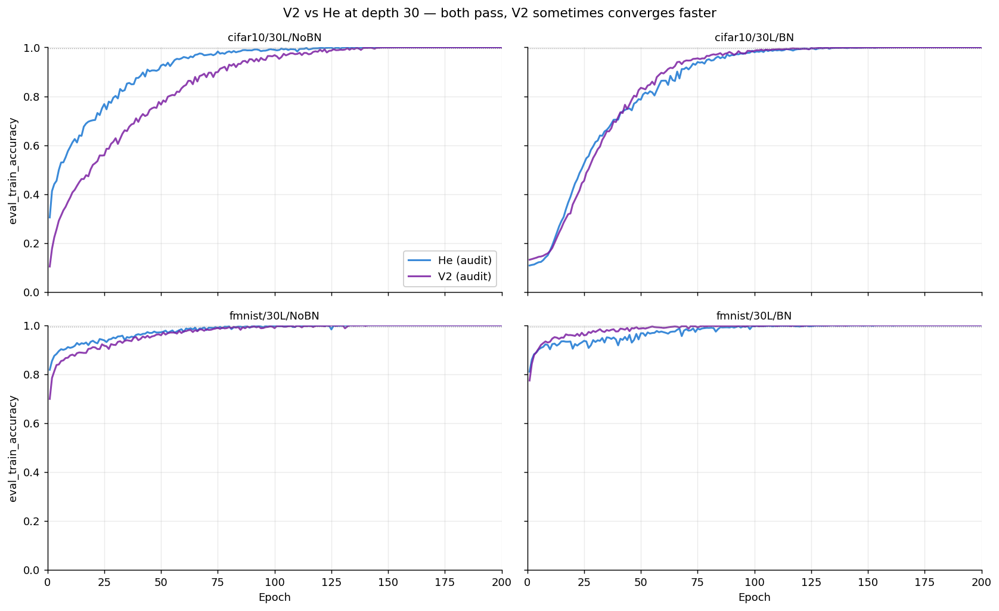
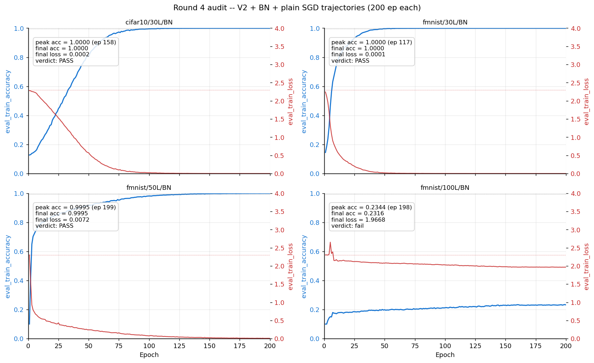

# 06 — V2 Row-Centered Audit, Rounds 1–4 (May 22–24, 2026)

**Question.** Can V2 (`row_centered_layer_balanced_product_base`, η=0.5) train the same 12-architecture grid that He handles — i.e., is "the right variance in each layer" enough? Gradient clipping forbidden throughout (assert-enforced in the runners).

**Builds on.** He's 10/12 scoreboard from campaigns [04](../04_he_final_audit/README.md)–[05](../05_sgd_recovery/README.md): round 1 runs the *He-passing recipes verbatim* so any deltas are attributable to the initializer. Item 3 of the May 22 post-meeting plan (`docs/plans_handoffs/2026-05-23_followup_plan.md`).

## What ran (V2, width 500, seed 42, smoke = 20 ep → audit = 200 ep)

| Round | Design | Labels |
|---|---|---|
| 1 | He-passing recipes verbatim, 10 architectures (100L/BN deliberately deferred) | `row_centered_{smoke,audit}_*` |
| 2 | Fixes for round-1 failures: η=0.1 at 100L/NoBN, lower LR + warmup at 50L | `row_centered_smoke2_*` |
| 3 | V2+BN+**Adam** at 100L (hypothesis: BN absorbs V2's forward amplification) | `row_centered_smoke3_*` |
| 4 | V2+BN+**plain SGD** — remove Adam's "double preconditioning" of V2's ~13,000× per-layer weight-std differential | `row_centered_{smoke4,audit4}_*` |

Runs auto-abort at 5× initial loss (`abort_on_explosion`), so "diverged" is a recorded verdict, not a crash.

## Findings — 5/12 architectures PASS, a depth ceiling, and the optimizer discovery



**Where V2 works, it matches He.** Round-1 audits: all four 30L cells reach 1.0000 eval-train accuracy (first pass at epochs 132/117/91/68). With round 4's fmnist/50L/BN, **5 of 12 architectures pass**.

**The depth ceiling is sharp and numerical.** At η=0.5, both 100L/NoBN smokes hit non-finite loss at *epoch 1, batch 0–2* — and η=0.1 doesn't save them (cifar10 aborts at loss ≈ 1.45×10²²). At 50L/NoBN the explosion is slower but still comes (fmnist: epoch 1–4; cifar10: survives its 20-epoch smoke stuck at 0.20, then its 200-epoch audit explodes at epoch 46). Per *architecture*, every NoBN cell at depth ≥ 50 ends in divergence; per *run*, 9 of 10 did.



**The decisive finding (round 3 vs 4).** Under Adam, fmnist/50L/BN sat stuck (0.334 in round 2) and both 100L/BN smokes flatlined at chance. Switching *only the optimizer* to plain SGD took fmnist/50L/BN to **0.9995 — PASS** (first crossing at epoch 138), and re-passed both 30L/BN cells. Interpretation: V2's per-layer weight scaling is itself a preconditioner; Adam's adaptive scaling fights it ("double preconditioning"), SGD's uniform step composes with it. 100L/BN still fails under both optimizers (best 0.23 — the joint wall from campaign 05, unchanged).

## Reproduce

```bash
cd ~/thesis
sbatch cluster/06_v2_row_centered/row_centered_smoke_<arch>.sub     # round 1 smoke (10 archs)
sbatch cluster/06_v2_row_centered/row_centered_audit_<arch>.sub     # promote survivors to 200 ep
sbatch cluster/06_v2_row_centered/row_centered_smoke4_<arch>.sub    # round 4 (BN + SGD)
sbatch cluster/06_v2_row_centered/row_centered_audit4_fmnist_50L_bn.sub
python3 cluster/06_v2_row_centered/triage_row_centered_smoke.py     # classify smokes: PASS/LEARNING/STUCK/DEAD/ABORTED
```

Expect `reports/results/row_centered_<mode><round>_<arch>.json` with full history + `abort_reason`/`status`; logs end with a `SUMMARY | PASS/fail` line (or `NO_HISTORY` if aborted pre-epoch-1). Smoke 1.5–3h, audit 4–10h by depth.

## Evidence & gaps

- Results: 32 `row_centered_*.json`; comparison figures `reports/figures/final_audit/final_v2_*.png`; 32 logs in `logs/slurm/06_v2_row_centered/`.
- **Gaps:** rounds 2–3 never reached audit stage (all their smokes failed — no `audit2_`/`audit3_` files exist by design); four round-1 audit `.sub`s were never submitted (their smokes aborted/stuck); cifar10/50L/BN never got a 200-epoch V2+SGD attempt (smoke4 showed 0.29, not promoted) — the one genuinely untested cell in the V2+SGD line.
