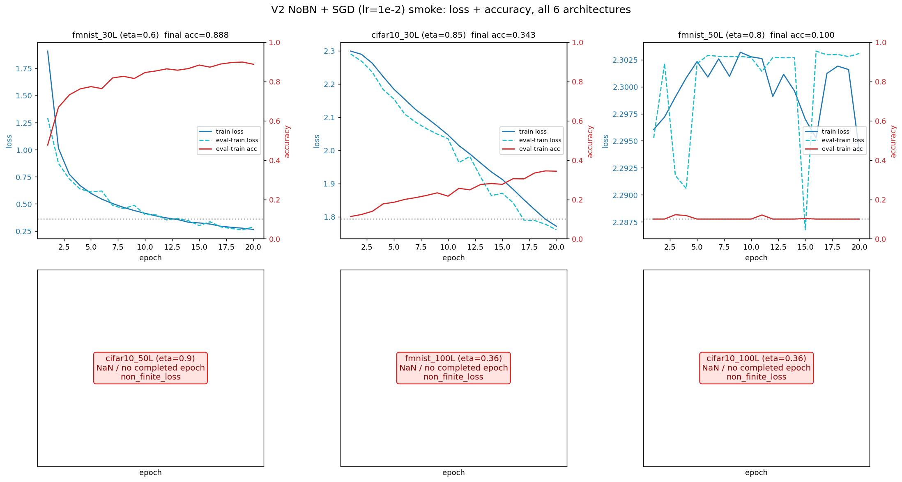
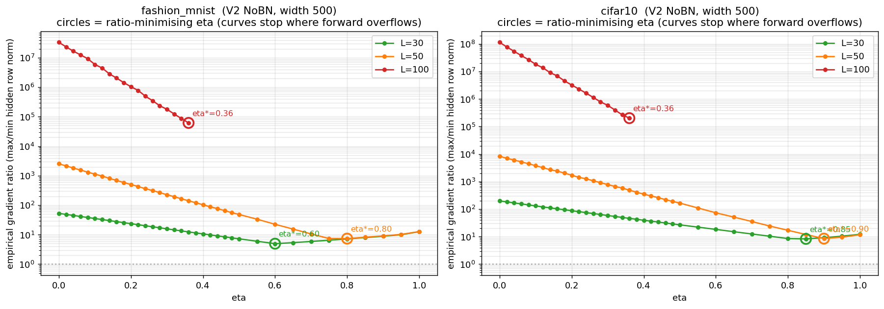

# 07 — V2 NoBN with per-architecture η\* (May 25, 2026)

**Question.** Can V2 train *without* BatchNorm if every architecture uses the η that empirically minimizes its per-layer gradient-ratio? Deliberately **no safety filtering** on η — where the ratio-minimizing η overflows the forward pass, that overflow is the result, not a config mistake.

**Builds on.** The η sweep (`scripts/eta_sweep_research.py` → `eta_sweep_research.json`, picked into `eta_star_recommended.json`): fmnist {30L: 0.60, 50L: 0.80, 100L: 0.36}, cifar10 {30L: 0.85, 50L: 0.90, 100L: 0.36}. Campaign [06](../06_v2_row_centered/README.md)'s finding that V2 wants plain SGD — hence SGD lr 1e-2, momentum 0, fixed LR, no clipping (assert-enforced).

## What ran

`run_v2_nobn_sgd.py`, three arms of 6 architectures ({fmnist, cifar10} × {30, 50, 100}L, NoBN, width 500, per-layer grads logged **every epoch**): smoke @ lr 1e-2 (20 ep), smoke @ lr 1e-6 (numerical-stability control), audit @ 200 ep (**subs exist, no results — see gaps**).

## Findings — no η rescues depth



At lr 1e-2 (from the 12 smoke JSONs):

| Cell | η\* | Outcome |
|---|---|---|
| fmnist/30L | 0.60 | learns — 0.899 @ ep19 (rising, far from criterion in 20 ep) |
| cifar10/30L | 0.85 | crawls — 0.345 @ ep19 |
| fmnist/50L | 0.80 | **stuck at chance** for 20 epochs (defying the runner's own NaN prediction) |
| cifar10/50L | 0.90 | **NaN** at epoch 1, batch 10 |
| both 100L | 0.36 | **NaN** at epoch 1, batches 6–8 |

The 50L outcome is dataset-dependent (stuck vs NaN) — a nuance the summary docs usually flatten. At lr 1e-6 all six cells survive numerically and *all six sit at chance*: the tiny LR removes the explosion and the learning with it.



The sweep explains the ceiling: the η range with finite gradients at L=100 ends at η=0.36, where the best achievable gradient ratio is still ~10⁴–10⁵× (vs ~5–8× at 30–50L). Ratio-minimization and forward finiteness are irreconcilable at depth — **V2's depth ceiling is structural**, which motivates fixing the backward pass outside the weights: campaign [09](../09_rcfwd_rescale/README.md).

## Reproduce

```bash
python3 scripts/eta_sweep_research.py && python3 scripts/eta_sweep_pick.py   # local, regenerates the sweep
cd ~/thesis
for a in fmnist_30L fmnist_50L fmnist_100L cifar10_30L cifar10_50L cifar10_100L; do
  sbatch cluster/07_v2_eta_nobn/v2_nobn_sgd_smoke_${a}.sub        # 2h each; NaN configs abort in minutes
  sbatch cluster/07_v2_eta_nobn/v2_nobn_sgd_lr1e6_smoke_${a}.sub  # stability control
done
```

Expect `reports/results/v2_nobn_sgd_{smoke,lr1e6_smoke}_<arch>.json` with per-epoch `grad_norm_per_layer`; diverged runs carry `abort_reason` and empty history. Note: the lr1e6 JSONs' internal `hypothesis_label` lacks the `lr1e6` tag — distinguish by filename / `training_config.learning_rate`.

## Evidence & gaps

- Results: 12 smoke JSONs + `eta_sweep_research.json` + `eta_star_recommended.json`; figures in `reports/figures/v2_eta_nobn/` and `reports/figures/eta_sweep/`.
- **Gaps:** the six 200-epoch `v2_nobn_sgd_audit_*.sub` were never run (or results never pulled) — the 200-epoch verdict for the two learning 30L cells is open. No SLURM logs were archived for this campaign. **Known repo inconsistency:** `eta_star_recommended.json` holds the *unfiltered* ratio minima (matching the runner's no-filter policy), but the current `scripts/eta_sweep_pick.py` applies a forward-safety filter and would emit different values (fmnist 0.60/0.26/0.06, cifar10 0.70/0.28/0.08) — the file predates the script's safety logic; regenerating it would change the runner's inputs.
