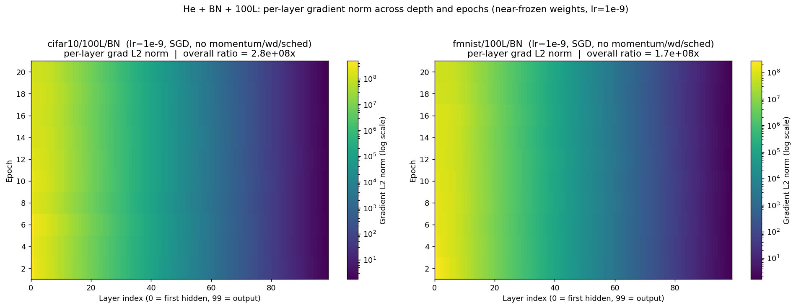

# 08 — He Low-LR Probe (May 25, 2026)

**Question.** Mechanism probe, not a pass attempt: is He+BN's 100L failure a *step-size* problem or a *gradient-conditioning* problem? If nothing learns even at lr=1e-9 — where the max-gradient layer's update is ~1e-4 per weight — the blocker is the conditioning ratio itself.

**Builds on.** Campaign [05](../05_sgd_recovery/README.md) left both 100L/BN cells unsolved under every recipe; campaign [04](../04_he_final_audit/README.md) measured per-layer gradient ratios of 10⁵–10⁷ there. This isolates the variable: He (explicitly *not* row-centered), BN, 100L, plain SGD, only the LR moved.

## What ran

`{cifar10, fmnist} × 100L/BN`, 20 epochs, bs 256, seed 42, no clipping, per-layer grads every 2 epochs:
- **Round 1** (`run_he_sgd_lowlr_smoke.py`): lr = 1e-6 + plateau. *Result JSONs not retained* — outcome survives only as the round-2 docstring's "No learning was observed in 20 epochs."
- **Round 2** (`run_he_sgd_lowlr2_smoke.py`): lr = **1e-9, fixed** — the update rule is purely `w ← w − 1e-9·grad`.

## Findings — the wall is conditioning, not step size



From `he_sgd_lowlr2_smoke_*_100L_bn.json`: both runs complete all 20 epochs with **no NaN**, and accuracy never leaves the chance band (0.097–0.103 across every epoch, both datasets). Meanwhile the per-layer gradient ratio starts at ~2.7×10⁸ / 1.6×10⁸ and *declines only ~3×* over 20 epochs (to 9.4×10⁷ / 4.5×10⁷) — improving but astronomically far from the ~10× of trainable networks. Two secondary observations: eval-mode loss spikes early (to 22.5 / 15.5 at epochs 2–3, partially recovering to ~6.5–7.0), tracking BN running-variance growth (max 4.5 → 9.5 on CIFAR-10) — BN statistics drift even while the weights are effectively frozen.

**Conclusion:** at 100L+BN, no learning rate can help — the gradient *direction structure* is broken at initialization. That is precisely the disease campaign [09](../09_rcfwd_rescale/README.md)'s per-layer gradient rescale is designed to cure (there for row-centered nets, where the ill-conditioning has a known closed form).

## Reproduce

```bash
cd ~/thesis
sbatch cluster/08_he_lowlr_probe/he_sgd_lowlr2_smoke_cifar10_100L_bn.sub   # 2h ceiling
sbatch cluster/08_he_lowlr_probe/he_sgd_lowlr2_smoke_fmnist_100L_bn.sub
# round 1 (lr=1e-6 + plateau) subs also exist: he_sgd_lowlr_smoke_*.sub
```

Expect `reports/results/he_sgd_lowlr2_smoke_<arch>.json`: 20-entry history with `eval_train_*`, `grad_norm_per_layer` (every 2 epochs), BN stats.

## Evidence & gaps

- Results: the two `lowlr2` JSONs; figure `reports/figures/he_lowlr_probe/he_lowlr2_100L_grad_heatmap.png` (content verified against the JSONs).
- **Gaps:** round-1 (lr=1e-6) JSONs were never retained — rerun the two `he_sgd_lowlr_smoke_*.sub` if those numbers are ever needed; no SLURM logs archived for this campaign; the heatmap's generating script isn't in the repo.
