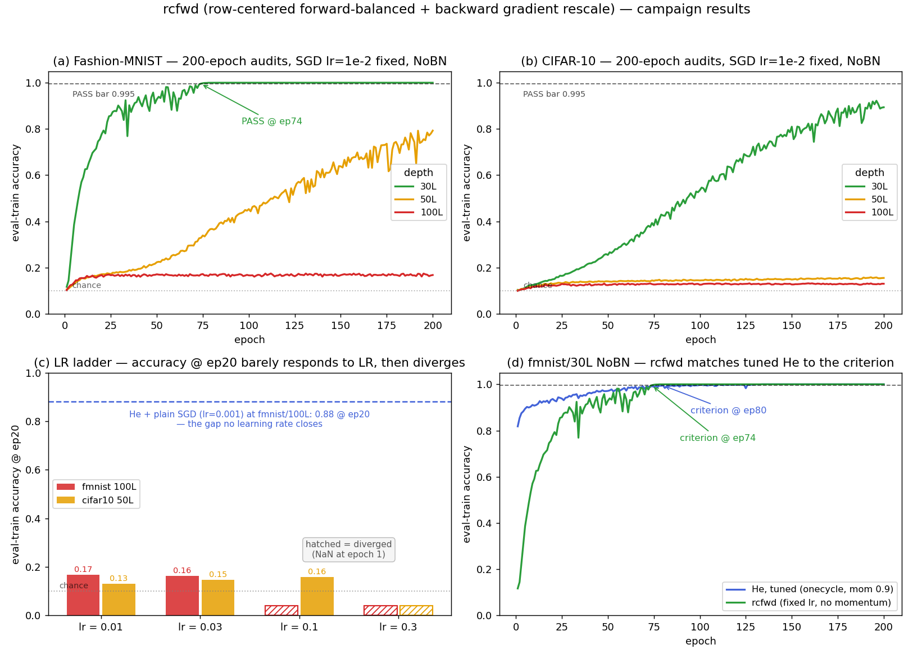
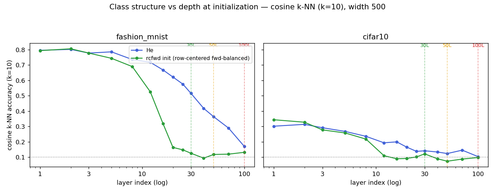

# 09 — rcfwd: Gradient Rescale (prepared May 25, 2026; smoke completed Jul 4)

**Question.** `row_centered_forward_balanced` keeps the forward pass perfectly flat (g_fwd = 1) but its backward gain is g_bwd = 1/r ≈ 1.21 per layer — compounding to ~10⁸ over 100 layers. A `GradRescale` op (identity forward, gradient × r = √((π−1)/π) ≈ 0.826 in backward) after each hidden ReLU cancels that *exactly, in closed form* — a non-adaptive per-layer LR of r^(L−l). Validated at initialization. **Does it train?**

**Builds on.** The whole arc: geometry says row-centering needs depth ([01](../01_geometry/README.md)); V2 hit a variance-overflow ceiling trying to fix the gradient ratio *inside the weights* ([06](../06_v2_row_centered/README.md), [07](../07_v2_eta_nobn/README.md)); the low-LR probe showed conditioning, not step size, is what blocks depth ([08](../08_he_lowlr_probe/README.md)). rcfwd moves the fix *outside* the weights, into the backward pass itself.

## The three requirements (the frame for the whole thesis)

Training a deep network from a fixed initialization needs **three** independent properties to hold *through depth*. Much of the confusion in this project came from treating them as one; this campaign is the experiment that pulls them apart.

| # | Requirement | What fails without it | Measured by |
|---|---|---|---|
| **(i)** | **Avoid geometric collapse** — the forward map must not send all inputs to a single direction / low-rank subspace | He compresses angles → 0 (arc-cosine kernel); effective dim → ~14 at depth | effective dimension, angle statistics ([01](../01_geometry/README.md)) |
| **(ii)** | **Gradient stability** — the backward map must keep per-layer gradient magnitudes comparable, so a single LR fits all layers | uncorrected row-centering: backward gain 1/r ≈ 1.21 compounds to ~10⁸; V2 overflows float32 | per-layer gradient-norm ratio `max_l/min_l ‖∂C/∂W^l‖` |
| **(iii)** | **Preserve class content** — the forward map must keep label-relevant structure alive, not just *any* structure | row-centering spreads into isotropic noise: k-NN → chance by ℓ≈25 (**"spread ≠ structure"**) | k-NN / linear probe on the representations at init |

The subtlety this campaign nails: **(i) and (iii) are not the same thing.** Avoiding rank collapse (i) is easy for row-centering — it spreads into ~950 effective dimensions. But that spread destroys (iii): the dimensions it fills are noise, not class structure. And **(ii) is independent of both** — rcfwd achieves (ii) perfectly while (iii) stays broken.

The 2×2 below shows all four combinations the program has actually produced. Read it as: *conditioning (ii) and content (i+iii) are orthogonal axes, and content is the binding constraint at depth.*

|  | **content ✓** (class structure survives) | **content ✗** (structure gone) |
|---|---|---|
| **conditioning ✓** (grads well-scaled) | **He / 30L** — trains fast | **rcfwd / 100L** — *stable but frozen* ← this campaign |
| **conditioning ✗** (grads ill-scaled) | **He / 100L NoBN** — Adam dies, plain SGD rescues (optimizer-fixable) | **V2 / 100L** — NaN at epoch 1 |

## The mechanism, validated at init

Without rescale — forward flat, backward explodes ~10⁸× (measured: rms(δ) ratio 1.39×10⁸ fmnist / 1.44×10⁸ cifar10 at 100L):


The per-layer backward gain is a clean constant ≈1.21 at every layer — which is exactly why a constant per-layer antidote works:


With `grad_rescale=r` — both directions flat; gradient ratio drops from ~5×10⁷–1.7×10⁸ to **5.8–6.5×** (He-like), rms(δ) ratio to 1.16–1.25×:


Implementation: `ClassifierConfig.grad_rescale` ([config.py](../../src/rp_study/config.py)) + `_GradRescale` autograd op applied after each hidden ReLU ([classifiers.py](../../src/rp_study/models/classifiers.py)); figures generated by `scripts/rcfwd_funnel100_fwd_bwd.py` and `scripts/rcfwd_gradrescale_funnel.py`.

## What runs

`run_rcfwd_gradrescale.py` — deliberately minimal so the rescale is the only new variable: init `row_centered_forward_balanced`, `grad_rescale=0.8256`, plain SGD lr 1e-2 (mom 0, wd 0, fixed LR), NoBN, width 500, bs 256, seed 42, no clipping (assert-enforced). Matrix: {fmnist, cifar10} × {30, 50, 100}L × {smoke 20 ep, audit 200 ep} = 12 subs. Smoke logs per-layer gradients **every epoch** — the first-ever view of whether the rescale survives training dynamics (weights won't stay row-centered as SGD updates them).

## Smoke results (20 epochs) — it trains, stably, everywhere

All six architectures completed 20/20 epochs with **no NaN, no abort** — the first row-centered configuration in this program to survive 100L NoBN training (V2 hit non-finite loss at epoch 1 on every ≥50L NoBN cell). From `rcfwd_rescale_smoke_*.json`:

| Cell | eval-train acc ep1 → ep20 | loss ep20 | grad ratio ep1 → ep20 | reading |
|---|---|---|---|---|
| fmnist/30L | 0.117 → **0.777** (rising) | 0.60 | 1.2× → 7.8× | learning strongly |
| fmnist/50L | 0.106 → 0.171 | 2.20 | 2.1× → 5.1× | slow, monotone |
| fmnist/100L | 0.102 → 0.168 | 2.21 | 3.3× → 18.5× | slow, monotone, **stable at 100L** |
| cifar10/30L | 0.104 → 0.149 | 2.25 | 2.3× → 2.2× | slow, monotone |
| cifar10/50L | 0.102 → 0.132 | 2.28 | 2.3× → 2.5× | slow, monotone |
| cifar10/100L | 0.099 → 0.126 | 2.29 | 2.3× → 5.6× | slow, monotone, stable |

Three observations. (1) **The mechanism survives training dynamics**: per-layer gradient ratios stay He-like (≤18.5×) for all 20 epochs — they drift upward as SGD moves the weights off exact row-centering (the rescale is static), but nowhere near the 10⁷–10⁸ it cancels at init. (2) **Learning is monotone but slow** everywhere except fmnist/30L — consistent with the geometry finding (campaign [01](../01_geometry/README.md)): forward-balanced row-centering preserves signal *scale*, not class structure, so representations must be rebuilt from noise. (3) **Bit-exact reproducibility**: the May-25 and Jul-4 runs (different SLURM jobs, ~6 weeks apart) produced identical metrics to 4 decimals (seed 42, e.g. fmnist/30L best 0.7774 both times).

**Verdict:** the campaign question — *does it train?* — is answered **yes on stability, partially on speed**. All six promoted to the 200-epoch audits; the open question is whether the slow cells accelerate as representations form or plateau far from the criterion.

## Diagnosing the slowness (Jul 5)

`scripts/depth_learning_speed.py` compares early learning speed across families from existing results (acc @ ep20, NoBN): He + *plain SGD lr=1e-3* reaches **0.88** at fmnist/100L where rcfwd (lr=1e-2) reaches 0.168 — so depth-100 NoBN is not intrinsically slow, and V2 at 30L learns fast (0.73–0.97) under hotter recipes (momentum + onecycle) — so row-centered content alone doesn't explain it either. Two hypotheses were pre-registered: **gradient scale** (the rescale equalizes all layers down to the output layer's small magnitude → try higher LR) vs **representation content** (class structure destroyed at depth → no LR helps). Test: the LR ladder.

## LR ladder + 200-epoch audits (Jul 6) — the content bottleneck wins



*(a,b) 200-epoch audits: trainability is depth-graded — 30L passes/climbs, ≥50L crawls or freezes. (c) The LR ladder: ep-20 accuracy is flat across the stable LR range, then NaNs — uninformative gradient directions, not undersized steps. (d) The headline: at 30L, untuned fixed-LR rcfwd crosses the criterion at ep74, ahead of tuned He (onecycle + momentum) at ep80. Generated by `scripts/rcfwd_campaign_summary.py`.*

**LR ladder** (`rcfwd_lr{3e2,1e1,3e1}_smoke_*.json`): raising LR does **not** accelerate learning and hits a hard wall. At lr=0.03, ep-20 accuracy is unchanged vs lr=0.01 (fmnist/100L 0.163 vs 0.168; cifar10/50L 0.147 vs 0.129). lr=0.1 NaNs at epoch 1 on fmnist/100L (survives on cifar10/50L: 0.159); lr=0.3 NaNs on both. Learning speed is **LR-insensitive across the entire stable range** — the signature of uninformative gradient *directions*, not undersized steps. The scale hypothesis is dead; the bottleneck is representation content.

**Audits** (200 ep, lr=1e-2, `rcfwd_rescale_audit_*.json`) — and the refinement that makes the story precise:

| Cell | ep20 → ep200 | to criterion | Verdict |
|---|---|---|---|
| fmnist/30L | 0.777 → **1.0000** (loss 3e-5) | **ep74** — vs tuned He's ep80 on the same cell | **PASS** |
| cifar10/30L | 0.149 → 0.894 (best 0.922 @ ep196, still climbing) | — | FAIL (near-pass trajectory, out of epochs) |
| fmnist/50L | 0.171 → 0.793 (accelerating: 50% @ ep114) | — | FAIL (alive, slow) |
| cifar10/50L | 0.129 → 0.155 | — | FAIL (stuck) |
| both 100L | flat 0.13–0.17 for 200 epochs | — | FAIL (frozen) |

Gradient ratios stay 3–37× through all 200 epochs — **long-term stability fully confirmed**.

**Terminology** (see the three-requirements frame above). *Conditioning* = requirement (ii), the backward-pass scale structure: the per-layer gradient-norm ratio `max_l/min_l ‖∂C/∂W^l‖` (from BP4, governed by the per-layer forward/backward gains, compounding as r^L). Bad conditioning means no global LR fits all layers; it says nothing about gradient *direction*. *Content* = requirement (iii), the forward-pass information structure at init: how much class-relevant input structure survives in `a^L(x)`, measured label-free by k-NN / linear probe on the representations (equivalently: how much the induced kernel `k_L(x,x′)` still varies with input similarity). The 2×2 above places every result: rcfwd/100L is content ✗ / conditioning ✓ — **stable but frozen**.

**The finding:** rcfwd is not uniformly slow — its trainability is depth-graded. Perfect gradient conditioning is **necessary but not sufficient**: gradient *flow* and representation *content* are separate, independently-measurable bottlenecks, and rcfwd is the experiment that separates them.

## Where the content dies — the probe chain (Jul 6)

Three rounds of init-time probes, each sharpening (and once *refuting*) the story; all reproducible from `scripts/content_probe_linear.py` and `scripts/content_profile_per_layer.py`:

1. **Final-layer probes** (`geometry_content_probe_*.json`, `content_probe_linear.json`): He's depth-L representations hold class structure at every trained depth (fmnist linear probe 0.55 → 0.29 from 30L to 100L); rcfwd's are at **chance at all depths under every ruler tried** — Euclidean k-NN, cosine k-NN, and linear probe alike. This confirms the content deficit vs He, but **refutes the naive prediction** that final-layer content explains rcfwd's own depth-grading: the predictor is flat while the outcome is graded (30L passes from a representation no linear readout can classify at init).

2. **The per-layer profile** (width 500 = the trained nets; the seed makes layer ℓ of the 30L and 100L nets *identical*, so one curve describes all three):



On fmnist (cosine k-NN, k=10 — scale-invariant; the linear probe in the same JSON draws the same curve within ~0.03 everywhere), rcfwd matches He through layers 1–3 (0.79–0.81 both), then collapses: 0.53 @ ℓ=12, 0.32 @ 16, 0.16 @ 20, chance from ℓ≈25 on. He glides down slowly — 0.52 @ 30, 0.36 @ 50, still 0.17 @ ℓ=100. The knee sits where the theory says it should: the class-correlated signal decays like r^ℓ = 0.826^ℓ (≈0.10 at ℓ=12) while forward-balancing holds the *total* RMS flat — so the SNR, not the scale, dies.

3. **The refined mechanism — noise-tail length.** Every rcfwd net starts with the same ~20-layer informative prefix; what grows with network depth is the tail of dead layers between that prefix and the loss:

| Net | informative prefix | noise tail | training outcome |
|---|---|---|---|
| 30L | ~20 layers | ~10 | **PASS** @ ep74 |
| 50L | ~20 | ~30 | crawl (0.79 @ ep200, fmnist) |
| 100L | ~20 | ~80 | frozen |

Trainability tracks the tail monotonically on both datasets (CIFAR's weaker prefix — 0.34 at ℓ=1 — additionally explains why its 30L crawls where fmnist's passes). The bottleneck is a *dynamics* quantity: gradient descent must rebuild the dead tail, and the error signal reaching the informative prefix decorrelates with every random layer it traverses backward.

**Conclusion, final form:** rcfwd fixes the backward pass completely; what it cannot fix is that the forward pass stops *delivering the data* after ~20 layers. The open problem is therefore precise: slow the per-layer content decay (He's profile is the benchmark) — e.g. partial centering, structure-preserving hybrids — screenable with these same probes before any training.

## Reproduce

```bash
cd ~/thesis   # after sync; clear __pycache__ first (config.py gained new fields)
for a in fmnist_30L fmnist_50L fmnist_100L cifar10_30L cifar10_50L cifar10_100L; do
  sbatch cluster/09_rcfwd_rescale/rcfwd_rescale_smoke_${a}.sub    # 2h each
done
# gate audits (6h each) on smoke triage:
# sbatch cluster/09_rcfwd_rescale/rcfwd_rescale_audit_<arch>.sub
```

Pull back with `bash cluster/pull_results.sh 'rcfwd_rescale_smoke_*' 09_rcfwd_rescale`. Logs end with `SUMMARY <label> | PASS/fail | ...`.

## Evidence & gaps

- Init-time validation: 5 figures in `reports/figures/rcfwd_rescale/` (May 25; a seed-123 replication included). The docstring's "grad ratio 5e7" baseline is the fmnist number — cifar10's is 1.7×10⁸, same story.
- **Gaps:** all 12 PASS/FAIL verdicts pending; the docstring's baseline attribution traces to the forward-balanced analysis, not a separate training campaign.
