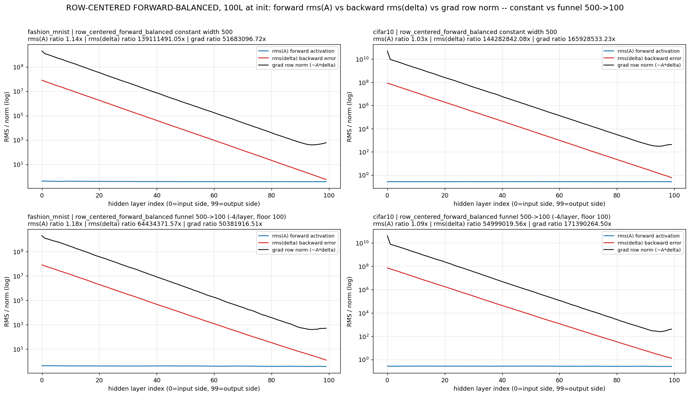
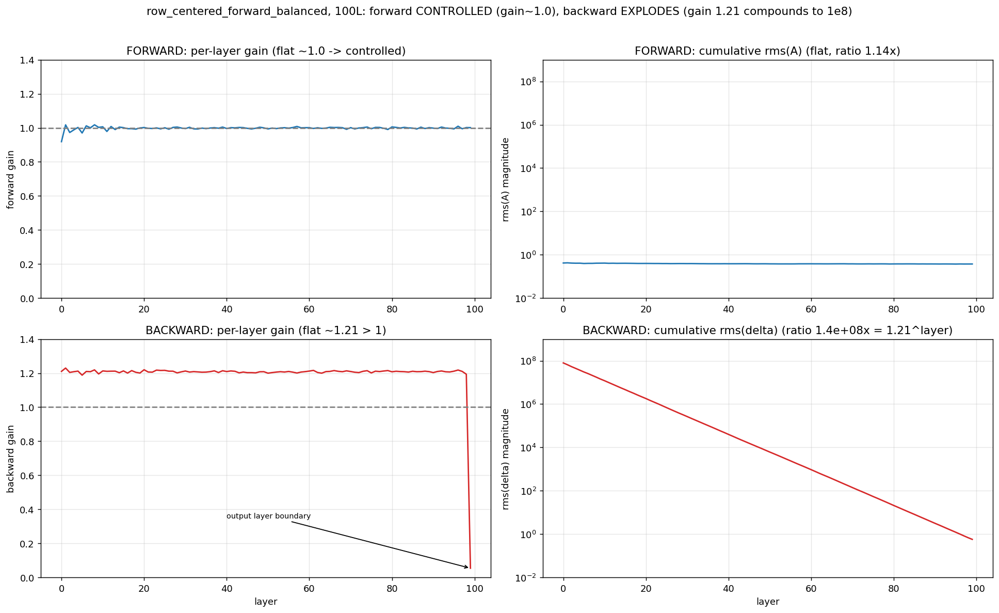
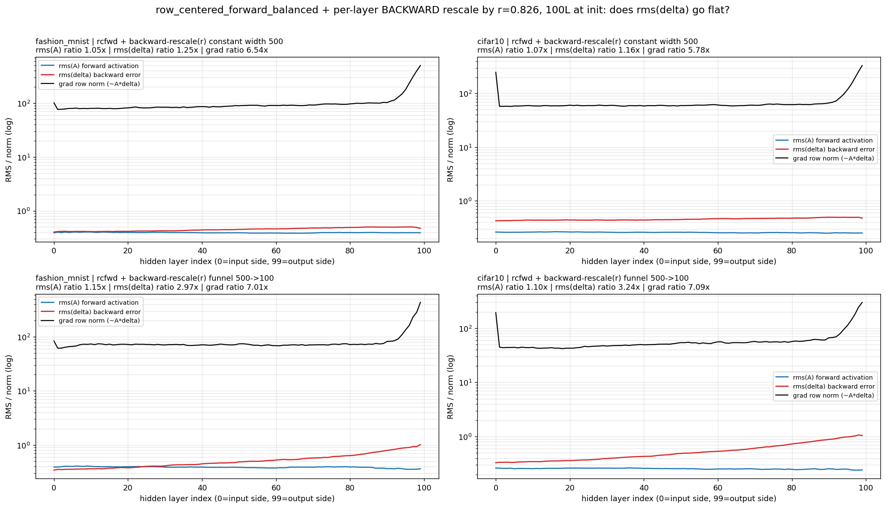

# 09 — rcfwd: Gradient Rescale (prepared May 25; smoke jobs first launched Jul 4, 2026)

**Question.** `row_centered_forward_balanced` keeps the forward pass perfectly flat (g_fwd = 1) but its backward gain is g_bwd = 1/r ≈ 1.21 per layer — compounding to ~10⁸ over 100 layers. A `GradRescale` op (identity forward, gradient × r = √((π−1)/π) ≈ 0.826 in backward) after each hidden ReLU cancels that *exactly, in closed form* — a non-adaptive per-layer LR of r^(L−l). Validated at initialization. **Does it train?**

**Builds on.** The whole arc: geometry says row-centering needs depth ([01](../01_geometry/README.md)); V2 hit a variance-overflow ceiling trying to fix the gradient ratio *inside the weights* ([06](../06_v2_row_centered/README.md), [07](../07_v2_eta_nobn/README.md)); the low-LR probe showed conditioning, not step size, is what blocks depth ([08](../08_he_lowlr_probe/README.md)). rcfwd moves the fix *outside* the weights, into the backward pass itself.

## The mechanism, validated at init

Without rescale — forward flat, backward explodes ~10⁸× (measured: rms(δ) ratio 1.39×10⁸ fmnist / 1.44×10⁸ cifar10 at 100L):



The per-layer backward gain is a clean constant ≈1.21 at every layer — which is exactly why a constant per-layer antidote works:



With `grad_rescale=r` — both directions flat; gradient ratio drops from ~5×10⁷–1.7×10⁸ to **5.8–6.5×** (He-like), rms(δ) ratio to 1.16–1.25×:



Implementation: `ClassifierConfig.grad_rescale` ([config.py](../../src/rp_study/config.py)) + `_GradRescale` autograd op applied after each hidden ReLU ([classifiers.py](../../src/rp_study/models/classifiers.py)); figures generated by `scripts/rcfwd_funnel100_fwd_bwd.py` and `scripts/rcfwd_gradrescale_funnel.py`.

## What runs

`run_rcfwd_gradrescale.py` — deliberately minimal so the rescale is the only new variable: init `row_centered_forward_balanced`, `grad_rescale=0.8256`, plain SGD lr 1e-2 (mom 0, wd 0, fixed LR), NoBN, width 500, bs 256, seed 42, no clipping (assert-enforced). Matrix: {fmnist, cifar10} × {30, 50, 100}L × {smoke 20 ep, audit 200 ep} = 12 subs. Smoke logs per-layer gradients **every epoch** — the first-ever view of whether the rescale survives training dynamics (weights won't stay row-centered as SGD updates them).

## Status & what to expect

**Training results: none yet.** The 6 smoke jobs were submitted 2026-07-04; `reports/results/rcfwd_rescale_*.json` will appear as they finish. Reading the smoke results: accuracy moving off chance by epoch ~5–10 and per-layer gradient ratios staying ~10× (not creeping back toward 10⁷) = the mechanism survives training → promote to audits. Watch the last ~8 layers and CIFAR-10's input layer — the residual ratio at init concentrates there.

## Reproduce

```bash
cd ~/thesis   # after sync; clear __pycache__ first (config.py gained new fields)
for a in fmnist_30L fmnist_50L fmnist_100L cifar10_30L cifar10_50L cifar10_100L; do
  sbatch cluster/09_rcfwd_rescale/rcfwd_rescale_smoke_${a}.sub    # 2h each
done
# gate audits (6h each) on smoke triage:
# sbatch cluster/09_rcfwd_rescale/rcfwd_rescale_audit_<arch>.sub
```

Pull back with `bash cluster/pull_results.sh 'rcfwd_rescale_smoke_*' 09_rcfwd_rescale`. Logs end with `SUMMARY <label> | PASS/fail | ...`.

## Evidence & gaps

- Init-time validation: 5 figures in `reports/figures/rcfwd_rescale/` (May 25; a seed-123 replication included). The docstring's "grad ratio 5e7" baseline is the fmnist number — cifar10's is 1.7×10⁸, same story.
- **Gaps:** all 12 PASS/FAIL verdicts pending; the docstring's baseline attribution traces to the forward-balanced analysis, not a separate training campaign.
