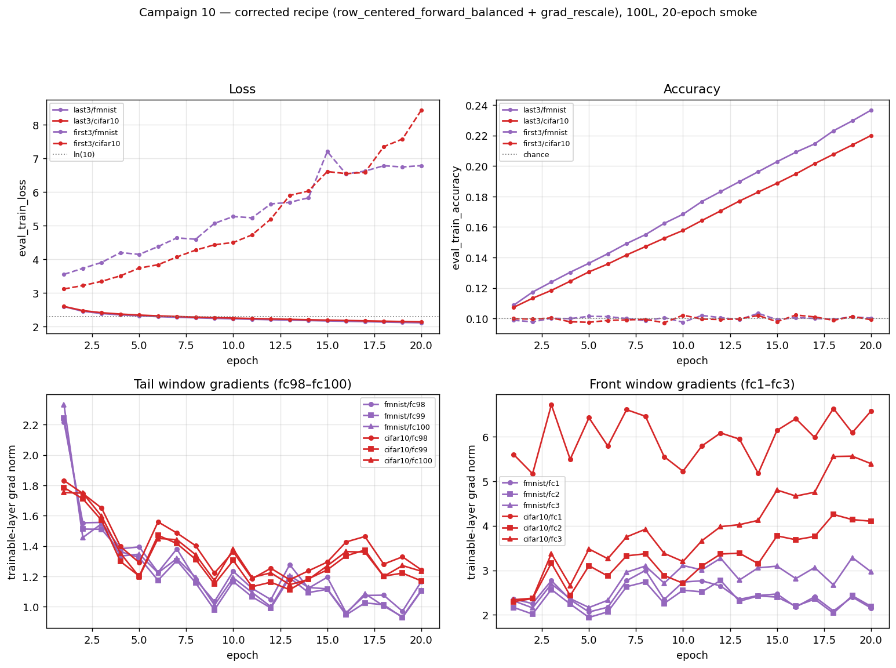
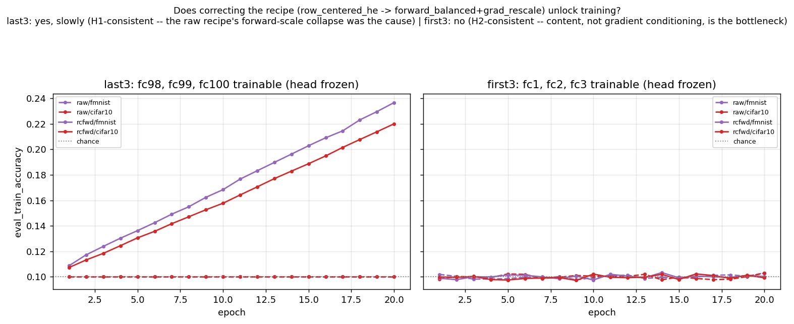

# 10 — rc frozen ends: where can trainable signal enter a deep row-centered net?

> **Design note:** an earlier internal draft of this campaign defined `last3` as training `fc99`, `fc100`, **and the output head**, while `first3` trained `fc1`-`fc3` with the head frozen — an *asymmetric* comparison (the head was trainable at one end but not the other). Corrected to the symmetric design below (`last3 = {fc98, fc99, fc100}`, head frozen in both conditions) before this campaign was handed to the oracle; `first3`'s results were unaffected (its head was already frozen). All numbers in this README are from the corrected, symmetric runs.

**Question.** At 100 layers with the **plainest row-centered initialization** (`row_centered_he` — He then subtract row means, no variance re-adjustment), train only a **3-layer window at the end** (hidden layers 98, 99, 100; everything else, including the output head, frozen) and, separately, a **3-layer window at the start** (hidden layers 1, 2, 3; everything else, including the head, frozen). The head is always the fixed readout — never part of either trainable window — so the two conditions are symmetric: same window size, same frozen head, only the window's position differs. Advisor's bet: training is fast in both cases. A second pass reruns the same design under campaign 09's corrected recipe (`row_centered_forward_balanced` + `grad_rescale`) to settle a live question about *why* the first pass fails (see §H1 vs H2). Brief: [`docs/plans_handoffs/briefs/2026-07-17_campaign10-rc-frozen-ends.md`](../../docs/plans_handoffs/briefs/2026-07-17_campaign10-rc-frozen-ends.md).

**Headline:** under the raw recipe, neither `last3` nor `first3` trains (§Findings) — both flat-dead at 20 epochs, by two different mechanisms. Under the corrected `rcfwd` recipe, `last3` **starts learning** (real signal, previously hidden behind a forward-scale artifact) while `first3` **still fails** — its loss actively worsens instead of staying flat, even though its gradients are healthy under both recipes (§H1 vs H2). The bottleneck is asymmetric by layer position: a scale problem at the tail (fixable by correcting the forward pass), a content/reachability problem at the front (not fixed by any gradient correction).

**Builds on.** Campaign [09](../09_rcfwd_rescale/README.md) showed rcfwd's gradient conditioning is solvable in closed form, but representation content decays and hits chance by layer ≈25 in the row-centered family (per-layer probe chain). `row_centered_he` (this campaign, no GradRescale) has the raw, uncorrected gain pair from the gain-coupling lock: `g_fwd ≈ 0.826`, `g_bwd ≈ 1.0` per layer — forward signal shrinks by `0.826^97 ≈ 1e-8` over the depth between layer 3 and the tail, while backward gradients traverse at roughly unit scale. This campaign asks, surgically: does trainable signal enter better through **a window sitting on that vanishingly small, content-dead representation** (`last3`), or through **an early window with full-content inputs but 97 frozen scrambling layers ahead of it** (`first3`)?

## Pre-registered predictions

- **Advisor's bet:** both conditions train fast.
- **Oracle's predictions (from campaign-09 data):** **last3** stuck at chance — that end of the network sits on representations that are content-dead (probe: chance by ℓ≈25) *and* vanishingly small in scale (`0.826^97`). **first3** slow or stuck — gradients arrive at ~unit scale (`g_bwd≈1`) and the first layers sit on full-content inputs, but any learned change must survive 97 frozen scrambling layers forward before it reaches the (frozen) head. Divergence between these predictions and the outcomes is the finding.

## What ran

`run_rc_frozen_ends.py` — deliberately minimal so freezing-location (and, in the second pass, recipe) is the only variable: NoBN, width 500, depth 100, plain SGD lr 1e-2 (mom 0, wd 0, fixed LR), bs 256, seed 42, no clipping (assert-enforced), normalize inputs. Two recipes: `raw` (`row_centered_he`, no `grad_rescale` — the original pass) and `rcfwd` (`row_centered_forward_balanced` + `grad_rescale=r≈0.826`, campaign 09's exact corrected recipe — see §H1 vs H2 below). Matrix: 2 conditions (`first3`, `last3`) × 2 datasets (`fmnist`, `cifar10`) × 2 recipes (`raw`, `rcfwd`) × {smoke 20 ep, audit 200 ep} = 16 subs. Smoke logs per-layer gradients every epoch (`diagnostics_every=1`, `log_grad_per_layer=True`).

Freezing implementation: `ClassifierConfig.trainable_layers` ([config.py](../../src/rp_study/config.py)) — additive, default `None` (no behavior change to any existing experiment) — applied in `DeepFCClassifier._freeze_except` ([classifiers.py](../../src/rp_study/models/classifiers.py)) as `requires_grad=False` on the frozen Linear layers' weight/bias tensors. This does **not** use `torch.no_grad()` or detach activations, so backprop still runs through frozen layers unchanged — gradients keep flowing to earlier trainable layers via the input-grad path.

## Freeze-mechanics verification (local, CPU, before any cluster sync)

Per the brief's constraint, the freezing mechanism was verified locally before syncing:

- **Trainable-tensor count**: both conditions report exactly 6 trainable tensors (3 Linear layers × {weight, bias}) via `DeepFCClassifier.trainable_tensor_count()`, asserted at runner startup (printed in the banner) and matching `2 × len(trainable_layers)`.
- **Gradient flow**: after a backward pass, `grad_norm_per_layer` is nonzero *exactly* at the named trainable fc-layers and zero everywhere else — confirming freezing suppresses only the named layers' own parameter gradients, not backprop through them.
- **`first3` full backward path**: with the head frozen, the loss gradient still traverses all 97 frozen layers back down to fc1–fc3 without error (2-epoch CPU run on fashion_mnist, 512 train samples, completes; `status=completed`, no divergence).
- **`last3` numerical watch-item (predicted in the brief) confirmed early**: in the CPU dry run, `last3`'s trainable-layer gradients (fc98, fc99, fc100) sit at **1e-10 to 1e-5 scale**, consistent with the `0.826^97` forward-signal collapse reaching that end of the network before any real training has happened.

Dry-run scripts are not committed (scratch); the assertions above are now load-bearing in `run_rc_frozen_ends.py`'s `main()` (trainable-tensor-count assert) and reproduced by any smoke run.

## Findings

**Both the advisor's bet and the "slow" half of the oracle's prediction are wrong — both conditions are flat-dead at 20 epochs, by two different mechanisms.** From `rcfrozen_{first3,last3}_smoke_{fmnist,cifar10}_100L.json`:

| Cell | ep1 → ep20 train acc | loss | trainable-layer grad norms | verdict |
|---|---|---|---|---|
| `last3`/fmnist | 0.1000 → 0.1000 (bit-exact) | 2.302585 (= ln 10, bit-exact, all 20 ep) | fc98,fc99,fc100: 1e-10–1e-5 @ ep1 → **exact float32 zero from ep7 on** | **DEAD** |
| `last3`/cifar10 | 0.1000 → 0.1000 (bit-exact) | 2.302585 (bit-exact, all 20 ep) | fc98,fc99,fc100: 1e-10–1e-5 @ ep1 → **exact float32 zero from ep17 on** | **DEAD** |
| `first3`/fmnist | 0.1019 → 0.1031 (noise) | 2.302585 (bit-exact, all 20 ep) | fc1–fc3: 1.2–2.2, stable, never vanishing | **STUCK** |
| `first3`/cifar10 | 0.0983 → 0.1029 (noise) | 2.302585 (bit-exact, all 20 ep) | fc1–fc3: 1.5–4.9, stable, never vanishing | **STUCK** |

(Verdict taxonomy from campaign 06's `triage_row_centered_smoke.py`: DEAD = grads at the numerical floor; STUCK = loss flat near initial despite live gradients.)


*Top row:* `eval_train_loss` (rounded to 6dp — the reported precision; raw values differ only in the 7th-8th decimal, ordinary float noise) and `eval_train_accuracy` for all four cells across the 20-epoch smoke — both bit-exact/pinned at `ln(10)` and chance respectively. *Bottom row:* the trainable-layer gradient norms that produce these two distinct flat lines — `last3`'s fc98/fc99/fc100 (left, log scale, floored at 1e-12 for display) collapse to exact float32 zero by epoch 7 (fmnist) / epoch 17 (cifar10); `first3`'s fc1-fc3 (right, log scale) stay in the healthy 1-5 range for all 20 epochs and never approach the numerical floor. Generated by [`scripts/rc_frozen_ends_plots.py`](../../scripts/rc_frozen_ends_plots.py) from the 4 smoke JSONs.

**`last3` confirms the oracle's prediction exactly, and sharper than predicted.** That end of the network sits on the `0.826^97 ≈ 1e-8`-scale forward signal (§Context), so its init-time gradient is already at the 1e-5–1e-10 floor (matches the local dry-run observation in the verification section above). Under 20 epochs of plain SGD that gradient does not recover — it shrinks *further* and hits exact float32 zero (not "very small", identically `0.0` in the logged tensor) within 7–17 epochs, after which the run is mathematically frozen: `0 × lr = 0` every step. `eval_train_accuracy` and `eval_train_loss` are bit-identical to `1/10` and `ln(10)` for all 20 epochs — the network is outputting an (effectively) uniform distribution the entire run, because the trainable window's weights never move enough to matter.

**`first3` refutes the "slow" half of the oracle's prediction — it is not slow, it is stuck.** Unlike `last3`, the fc1–fc3 gradients are healthy and *never vanish*: order 1–5 in magnitude, stable across all 20 epochs (no float32 floor problem here — the input is full-scale, undamaged data). Despite ~4,700 SGD steps (fmnist, 20 ep × ~235 batches) actually updating these weights every step, `eval_train_loss` does not move even in the 6th decimal place — it is bit-identical to `ln(10)` at every logged epoch on both datasets. This is stronger than "slow": whatever fc1–fc3 learn about the input gets **completely absorbed** by the 97 frozen, never-updated downstream layers before it reaches the loss — consistent with the campaign-09 finding that row-centered forward maps at this depth sit at a content-dead fixed point, but sharpened here: even *targeted* representation changes at the very front of the network produce no detectable output-level effect through that fixed frozen stack, at least within the smoke horizon.

**Triage call: do not gate to audit.** Both conditions show zero epochs of measurable progress across the full smoke window — `last3` because its gradient literally reached zero, `first3` because 20 epochs (~4,700 steps) of live, non-vanishing gradient produced no loss movement at all (not even a slow decline masked by noise). Unlike campaign-09 cells that were promoted on partial, decaying-but-still-decreasing loss curves, there is no comparable signal here to extrapolate from. 200 more epochs cannot move `last3` (its gradient is identically zero) and there is no evidence-based reason to expect `first3` to behave differently at 200 epochs than at 20. Per the brief, none of the four cells is promoted to the 200-epoch audit; the four unused `.sub` files (`rcfrozen_*_audit_*_100L.sub`) remain available if the advisor wants a direct 200-epoch confirmation regardless.

**Answering the campaign question:** neither entry point trains — signal cannot productively enter a 100L plain-row-centered net through either the last three layers (content + scale both dead there) or the first three (content and scale are fine, but 97 untrained frozen layers downstream absorb any change before it reaches the loss). This sharpens Phase 6/campaign-09's "content, not conditioning, is the bottleneck" finding: it is not merely that *forward-propagated* content is dead at depth — the network's *insensitivity* extends to gradient-driven changes made anywhere in it, front or back, as long as the vast majority of the stack stays frozen at this initialization.

## H1 vs H2: does the raw-recipe failure indict the gradient rescale, or confirm content death?

This campaign was partly motivated by a live disagreement about *why* campaign 09 (rcfwd) needed its `grad_rescale` correction at all. Campaign 09's `row_centered_forward_balanced` init keeps the **forward** activation RMS flat by construction, but that flatness forces the **backward** gain to compound at `1/r ≈ 1.21` per layer — over ~100 layers the raw, uncorrected gradient would blow up by roughly `1.21^97`. `grad_rescale=r` is a fixed, depth-known multiplier (via the `_GradRescale` op: identity forward, `× r` in the backward pass) that cancels this exactly — it is *not* adaptive gradient-norm clipping (which this project forbids for training instability in general), but it is still an artificial correction to the raw gradient, and that raised a genuine question:

- **H1 (the advisor's worry):** the rescale might not just be conditioning the gradient's *scale* — by uniformly damping every layer's backward signal, it could be suppressing or redirecting a gradient that, left alone, points somewhere real and useful. Under H1, a much smaller-scope problem — training only 3 layers, where no whole-network rescale is even necessary — should be able to train fine on the **raw**, uncorrected init, since there's no long compounding chain for an artificial correction to distort.
- **H2 (the standing campaign-09 finding):** the real bottleneck is that row-centered representation *content* dies (linear-probe accuracy at chance by layer ≈25, per campaign 09's probe chain) — a forward-propagation fact that has nothing to do with backward gradient conditioning. Under H2, training only 3 layers should fail too, regardless of whether any rescale is applied, because the trainable layers either sit on already-dead forward content (`last3`) or feed into a downstream stack that will destroy whatever they learn (`first3`).

**The raw-recipe results above already discriminate against H1.** Neither failure mode is a gradient-direction/magnitude story: `last3` dies from forward-scale decay (`0.826^97`) reaching that end of the network — a fact about the forward pass, present with or without any backward rescale. `first3`'s gradients are healthy and well-scaled (order 1–5, no correction needed, no rescale ever applied here) and *still* produce zero loss movement, because the 97 frozen downstream layers absorb the change. If H1 were the real story, `first3` in particular — no rescale in play, healthy gradients, full-content input — should have trained. It didn't.

**Direct follow-up, run as part of this campaign (not a separate one):** the same `first3`/`last3` frozen-layer design, rerun with campaign 09's *exact* corrected recipe — `row_centered_forward_balanced` init + `grad_rescale=r=sqrt((π−1)/π)≈0.826` — instead of raw `row_centered_he`. This isolates the rescale as the only changed variable. Two clean, falsifiable predictions:

- **If H1 is right:** the corrected recipe should let `last3` and/or `first3` train where the raw recipe didn't, because the "real" gradient is no longer being suppressed by depth-wide raw-gradient blowup dynamics that the frozen-3-layer raw setup never actually had in the first place.
- **If H2 is right:** both conditions should still fail to train — `last3` should no longer show the exact-float32-zero underflow signature (the rescale keeps backward gain at unit scale by construction), but should still show flat/negligible progress; `first3` should look qualitatively identical to the raw pass (healthy gradients, zero progress) since the rescale doesn't touch the forward pass or the content-death mechanism at all.

**Result: the answer is asymmetric, and it's not a clean win for either hypothesis.** From `rcfrozen_{first3,last3}_smoke_{fmnist,cifar10}_100L_rcfwd.json`:

| Cell | ep1 → ep20 train acc | ep1 → ep20 loss | trainable-layer grad norms | verdict |
|---|---|---|---|---|
| `last3`/fmnist (rcfwd) | 0.1087 → **0.2366** (steady climb) | 2.597 → **2.117** (steady fall) | fc98,fc99,fc100: 2.2–2.3 → 1.10–1.17, healthy throughout, no underflow | **LEARNING** |
| `last3`/cifar10 (rcfwd) | 0.1073 → **0.2200** (steady climb) | 2.603 → **2.144** (steady fall) | fc98,fc99,fc100: 1.75–1.83 → 1.17–1.24, healthy throughout | **LEARNING** |
| `first3`/fmnist (rcfwd) | 0.0988 → 0.1003 (still chance, noisy) | 3.556 → **6.787** (climbs well past ln 10) | fc1–fc3: 2.0–2.8 → 2.2–3.3, healthy, never vanishing | **chance acc, worsening loss** |
| `first3`/cifar10 (rcfwd) | 0.0999 → 0.0992 (still chance, noisy) | 3.122 → **8.438** (climbs well past ln 10) | fc1–fc3: 2.3–6.7 → 2.2–6.6, healthy, never vanishing | **chance acc, worsening loss** |





**`last3` starts learning once the recipe is corrected — this is genuinely H1-consistent, but for a more precise reason than "the rescale was masking a real gradient."** `row_centered_forward_balanced` keeps the *forward* activation RMS flat by construction (unlike plain `row_centered_he`, which decays it at `0.826^L`). That alone removes the specific mechanism that killed `last3` in the raw pass: the trainable window's input is no longer vanishingly small in scale, so its gradients never underflow (they stay at a healthy order-1 magnitude for all 20 epochs, gently settling from ~2 to ~1.1–1.2 rather than collapsing to `0.0`). With a non-dead-scale input and a well-conditioned gradient, SGD can now make real, steady progress: train accuracy climbs monotonically from ~11% to ~24% (fmnist) / ~22% (cifar10) over 20 epochs — far short of the 99.5% pass bar, and clearly *slow* (a healthy shallow classifier would be well past this by epoch 1–2), but unambiguously real learning, not noise. So the raw recipe's `last3` failure was a **forward-scale artifact**, not evidence that the representation reaching layer 98–100 carries zero usable information — correcting the scale (regardless of whether one calls that "removing the rescale's distortion" or "fixing the forward pass") unlocks a real, if weak, signal.

**`first3` still doesn't train under the corrected recipe — and gets worse in a new way, not better.** Both fc1–fc3 gradients are healthy (order 2–7, never vanishing) under *both* recipes — grad_rescale was never the limiting factor here, exactly as the raw-pass result already implied. But instead of the raw recipe's bit-exact-flat-at-`ln(10)` inertness, the rcfwd loss now climbs steadily to 6.8–8.4 while accuracy stays pinned at chance. The likely mechanism: fc1–fc3 *are* being updated by a well-scaled, non-trivial gradient every step, and that update does propagate some structured (if class-uninformative) change through the 97 frozen forward-balanced layers — enough to push the output distribution away from the initial uniform guess (raising cross-entropy) without ever aligning with the true labels (accuracy never leaves chance). This is a different failure signature from the raw pass's total inertness, but it is not training, and it does not fit any variant of "the correction was hiding a recoverable signal" — if anything, a real, well-scaled gradient at the front is now visibly doing *something* to the network, and that something is unrelated to the task.

**Net verdict on H1 vs H2: neither is universally right — the resolution is which layer you're standing at.** `last3`'s raw-pass death was a **scale** problem (H1-adjacent: fixing the numerical/forward-scale issue reveals real signal), not a **content** problem — it does *not* support the strong form of "content is already dead by layer 25" applied literally at layers 98–100, at least not to the point of zero exploitable signal. `first3`'s failure under both recipes is unambiguously **not** a gradient-conditioning problem (H2-consistent) — it is something about how a small, local, well-trained change at the front interacts with 97 fixed, untouched downstream layers, which the corrected recipe does nothing to fix because it doesn't touch that mechanism. Practically: if the goal is to get *some* trainable signal into a 100L row-centered stack via a small subset of layers, the tail is the promising end (slow but real), and the front is a dead end regardless of gradient conditioning.

## 2026-08-15 continuation (W5): 2-layer windows + the missing 2x2 corners

Brief: [`docs/plans_handoffs/briefs/2026-08-15_campaign10-2layer-windows-and-recipe-ablation.md`](../../docs/plans_handoffs/briefs/2026-08-15_campaign10-2layer-windows-and-recipe-ablation.md). Two advisor follow-ups from the 2026-08-15 meeting, answered in this campaign directory: (1) redo the frozen windows one layer narrower (`last2={fc99,fc100}`, `first2={fc1,fc2}`, head frozen in both, same symmetric design as `last3`/`first3`) and push the one working cell (`last3`/rcfwd) to a real accuracy target instead of a 20-epoch smoke; (2) run the two corners of the (init x grad_rescale) 2x2 that campaigns 09/10 never ran, so "the rcfwd recovery was a forward-scale artifact" becomes a measurement rather than an inference.

**Status: runner + submission infrastructure complete and locally verified; no cluster jobs have been run yet.** This agent session has no SSH/scp/sbatch access to the cluster (the same constraint noted in the brief as having stalled this campaign's first pass). Everything through "Local verification" below is done and checked against the code/math directly; everything after that is marked PENDING, with the exact handoff commands in Reproduce.

### Runner changes

`run_rc_frozen_ends.py` gained, additively -- no existing label's resolved config changed:

- Two new recipes in `RECIPES`/`RECIPE_SUFFIX`, decomposing rcfwd into its two independent interventions (init change (A), backward `grad_rescale` (B) -- see the oracle note on W5 in `docs/plans_handoffs/FRONTIER.md`):
  - `rawrescale` (suffix `_rawrescale`) = `row_centered_he` + `grad_rescale=r` -- **(B) only**, "correction for the backward only."
  - `fwdbal` (suffix `_fwdbal`) = `row_centered_forward_balanced`, no rescale -- **(A) only**.
  - (`raw` = neither, `rcfwd` = both -- both unchanged from the original campaign.)
- Two new conditions in `TRAINABLE_LAYERS`: `first2=["fc1","fc2"]`, `last2=["fc99","fc100"]`. `first3`/`last3` untouched, so the 8 committed JSONs stay reproducible from the same labels.
- `--target-train-accuracy` (wires the pre-existing `TrainingConfig.target_train_accuracy`, default `None` — unchanged existing behavior for every label that doesn't pass it) and `--target-patience`.
- A `rawrescale` LR ladder (`RAWRESCALE_LR_LADDER` / `RAWRESCALE_LADDER_LABELS`): 4 extra fully-qualified smoke labels per (condition, dataset) beyond the control point, e.g. `rcfrozen_last2_smoke_fmnist_100L_rawrescale_lr1e6`. The numeric LR is never parsed back out of the label string -- each ladder `.sub` passes `--lr` explicitly (see `_strip_lr_ladder_tag`'s docstring for why).

### `_parse_label` rewrite — the highest-risk edit, verified two ways

The old `label.endswith("_rcfwd")` check does not generalize safely to 4 recipes: `RECIPE_SUFFIX["raw"] == ""`, and checking suffixes in plain dict/insertion order would match **every** label as `"raw"` first, since an empty suffix `endswith()`-matches everything. Fixed by trying suffixes longest-first (`_RECIPE_SUFFIX_ORDER`, computed by sorting on suffix length descending — `raw`'s `""` is necessarily last) and adding `_check_label_roundtrips()`, which runs unconditionally at **import time** over all 80 entries of `EXPERIMENT_LABELS` (64 base grid + 16 rawrescale-ladder) and asserts each parses back to exactly the components used to build it.

1. **The self-test passes as written.** `python3 -c "import run_rc_frozen_ends"` succeeds silently — the assertion loop runs at import time, so a regression would raise `AssertionError` before any argparse call, on the very first invocation.
2. **The self-test is not vacuous — confirmed by deliberately reproducing the bug it guards against.** Simulating the naive insertion-order check (`for recipe, suffix in RECIPE_SUFFIX.items(): if label.endswith(suffix): return recipe`) against every `EXPERIMENT_LABELS` entry mis-parses **64 of 80** labels as `"raw"` — everything except the 16 labels that are genuinely `raw`. Example: `rcfrozen_first3_smoke_fmnist_100L_rcfwd` → naive parse = `raw`, correct = `rcfwd`. This is exactly the failure mode the brief flagged: silently running the wrong recipe under the right filename, with no error.

### Local verification (CPU, before any cluster sync — per the brief's constraint)

- **Freeze mechanics, first2/last2, both raw and rcfwd:** `trainable_tensor_count()==4` in all four cases (2 layers × {weight, bias}); after one backward pass, nonzero gradient at exactly `{fc1,fc2}` (first2) or `{fc99,fc100}` (last2) and zero everywhere else, including the head. Matches the brief's "trainable tensors=4 (expect 4)" requirement exactly.
- **All four recipes build and run one forward/backward step without exception** on `last2` (raw, rcfwd, rawrescale, fwdbal) — finite loss at init in all four.
- **`--target-train-accuracy` plumbing:** a 3-epoch CPU run (512 fmnist train samples, `last2`/rcfwd, `target_train_accuracy=0.99`, `target_patience=1`) completes cleanly with `stop_reason=max_epochs` (0.99 correctly not reached on 3 tiny epochs over a 512-sample subset — no false trigger) — confirms the flag is wired without crashing.

### The 2x2 ablation table (init-time — already measured, re-verified here field-by-field)

100L, width 500, batch 128, seed 42 — `reports/results/recipe_decomposition_funnel.json`, produced by `scripts/recipe_decomposition_funnel.py` on 2026-08-15, before this brief was written. Reproduced here with exact field names so every number traces directly:

| corner | `init_strategy` | `grad_rescale` | `activation_rms[-1]` (L100) | `grad_norm_per_layer[0]` (fc1) | `grad_norm_per_layer[-1]` (fc100) | `grad_max_over_min` |
|---|---|---|---|---|---|---|
| `raw` | `row_centered_he` | `None` | 5.009e-9 | 1.906 | 1.149e-8 | 1.659e8 |
| `raw+rescale` (`rawrescale`) | `row_centered_he` | `r=0.82565` | 5.009e-9 (bit-identical to raw) | 9.109e-9 | 9.484e-9 | **1.127** |
| `fwdbal` | `row_centered_forward_balanced` | `None` | 1.2551 | 4.612e8 | 3.427 | 1.346e8 |
| `rcfwd` | `row_centered_forward_balanced` | `r=0.82565` | 1.2551 | 2.204 | 2.829 | 1.353 |

Three consequences, load-bearing for the grid design (per the brief) and for the local-verification surprise below:

1. `raw+rescale`'s activations are **provably** bit-identical to `raw`'s — `_GradRescale.forward` is `return x` (identity), so this is a property of the autograd Function, not a measurement that could come out otherwise. Any explanation of `last3`/`last2`'s recovery that runs through *activations* must therefore be an (A) story (the init change), since (B) (the rescale) cannot touch the forward pass at all.
2. `raw+rescale` has the flattest gradient profile of all four corners (1.127× across 100 layers — flatter than rcfwd's 1.353×) but pinned at ≈9e-9. The analytically-matched LR is `1e-2 / R**100 = 2,092,427` (`R=0.8256452711765564`, `R**100=4.779e-9`, computed directly here — not just "≈2e6") — this is *why* the suggested ladder brackets `1e6`–`1e7` with `1e2`/`1e4` as intermediate rungs. The `lr=1e-2` control point is analytically guaranteed inert (a ≈9e-9-scale gradient at that LR moves weights by ≈9e-11 per step) — this is known **before running anything**, from the funnel numbers alone.
3. `fwdbal`'s `grad_norm_per_layer[0]` (fc1, 4.6e8) is the number the brief's "expected to abort" language is built on — but that is the gradient **at fc1**, not at fc99/fc100. See next section: freezing changes which of these numbers a given trainable window ever actually sees.

### A brief-vs-measurement discrepancy, found by the mandated local check: `last2`/`fwdbal` does not abort

The brief's smoke-grid item 3 says `{last2} × {fmnist,cifar10} × {fwdbal}` is "expected to abort; documented as such." Running the mandated freeze-mechanics check on this specific corner surfaced a real discrepancy, reported here rather than silently reworded away:

- **Why the brief's expectation doesn't hold for `last2` specifically.** `fwdbal`'s exploding gradient (4.6e8) lives at **fc1** and decays monotonically to a near-normal ≈3.4 by fc100 (funnel table above) — the blow-up is concentrated at the *front*, where backward-gain compounding (`1/r` per layer, uncancelled) has the most layers to compound over. `last2` only trains fc99/fc100. Because `requires_grad=False` on fc1–fc98 means autograd's graph-construction rule ("a node requires grad iff at least one of its inputs does") makes the *activation* flowing out of fc98 have `requires_grad=False` too, PyTorch never builds — let alone computes — a backward path into the frozen fc1–fc98 stack at all. `last2`'s optimizer only ever sees fc99/fc100's own gradient, which the funnel table already shows is ≈3–4 at init, nowhere near 4.6e8.
- **Verified locally (CPU, small subsample — NOT the committed cluster result):** 5-epoch run, 4000 fmnist train samples, `last2`/fwdbal: loss falls steadily (3.24 → 2.67), train acc climbs (10.5% → 14.3%), trainable-layer grad norms stay in a healthy 2–4 range across all 5 epochs — **no abort**, real if slow learning, structurally similar in character to `last3`/rcfwd's original 20-epoch trajectory. The same setup on `first2`/fwdbal (not part of the brief's grid) **does** abort as expected: `status=diverged`, `stop_reason=non_finite_loss`, NaN loss at epoch 1 batch 4 — confirming the funnel's front-loaded-explosion mechanism is real, just not exercised by a tail-only trainable window.
- **What this means, and what's still open.** This is informative either way (per the brief: "a clean documented abort IS the result" — so is a clean documented non-abort). If the real 20-epoch GPU smoke on the full dataset confirms the local finding, it would mean that for the *tail* specifically, (A) alone (the forward-balanced init) is enough to get real learning with no backward correction at all — sharpening the campaign's central question. The local check is only 5 tiny-batch CPU epochs on a 4000-sample subset, not a substitute for the actual 20-epoch full-dataset GPU run the brief specifies, which is still queued (see Reproduce). `first2`/fwdbal was not added to the submission grid — out of the brief's explicit scope, which names only `last2` — but is noted here as a natural, cheap follow-up if the advisor wants the predicted-explosion corner measured directly on the cluster.

### 2-layer vs 3-layer windows, and the isolation verdict — both PENDING cluster execution

Everything above (self-test, freeze mechanics, the 2×2 table, the fwdbal finding) is either a structural property of the code/math or a small local CPU check. **No 20-epoch or 400-epoch GPU run has been executed for any new label in this section** — this agent session cannot reach the cluster (see Reproduce for the exact handoff). Consequently:

- The "2-layer results next to the 3-layer ones" table the brief asks for cannot be filled in yet beyond the structural check above (trainable-tensor count, gradient location). Once the smoke grid runs, add a table here in the same shape as the raw-recipe and rcfwd-recipe tables under Findings/H1-vs-H2 above.
- **The isolation verdict is therefore partial.** Already established without needing a new run: (a) any activation-side story about `last3`'s recovery must be an (A) story, never a (B) story (proven, not measured — `_GradRescale` is forward-identity by construction); (b) `raw+rescale`'s `lr=1e-2` control point is analytically inert, so the ladder's higher rungs are the earliest point this corner could show anything at all; (c) `last2`/fwdbal's local non-abort is suggestive that (A) alone may already do most of the tail's work, matching the general character of `last3`/rcfwd's slow-but-real recovery. **Not yet known:** whether `rawrescale` moves at all once the LR reaches the ≈2.09e6 neighborhood (the (B)-only, at-scale test); whether `fwdbal`'s local non-abort survives the full dataset and 20 real epochs; whether `last2`/`last3` under rcfwd actually reach the 0.99 target, and in how many epochs. Filling this in is the next session's first job once the jobs below have run.

## Reproduce

### Original 3-layer campaign (raw/rcfwd, first3/last3) — already run, JSONs committed

```bash
cd ~/thesis   # after sync; clear __pycache__ first (config.py gained a new field)
for cond in first3 last3; do
  for ds in fmnist cifar10; do
    sbatch cluster/10_rc_frozen_ends/rcfrozen_${cond}_smoke_${ds}_100L.sub        # raw recipe, 2h each
    sbatch cluster/10_rc_frozen_ends/rcfrozen_${cond}_smoke_${ds}_100L_rcfwd.sub  # rcfwd recipe, 2h each
  done
done
# gate audits (6h each) on smoke triage:
# sbatch cluster/10_rc_frozen_ends/rcfrozen_<cond>_audit_<ds>_100L[_rcfwd].sub
```

Pull back with `bash cluster/pull_results.sh 'rcfrozen_*_smoke_*' 10_rc_frozen_ends`. Logs end with `SUMMARY <label> | PASS/fail | ...`.

### W5 continuation (2026-08-15) — prepared, verified locally, NOT yet submitted

**This agent session cannot SSH/scp/sbatch to the cluster.** The 34 new `.sub` files below are written, and every one of them was dry-run through the real `argparse` → `_build()` → trainable-tensor-count-assert pipeline locally (training itself stubbed out) with no failures. Exact handoff, in priority order (brief §Constraints: submit the target-accuracy runs first — they are the deliverable):

```bash
# 1. Local Mac terminal -- push code (carries the runner changes + all new .sub files)
bash cluster/sync_to_cluster.sh

# 2. Cluster terminal -- clear stale bytecode, then submit
source cluster/cluster.env && ssh "$CLUSTER_USER@$CLUSTER_HOST"
find ~/thesis/src ~/thesis/cluster -name "__pycache__" -exec rm -rf {} +
cd ~/thesis

# --- Tier 1 (THE DELIVERABLE): target-accuracy runs -- last2+last3 x rcfwd, 400ep, target 0.99, ~12h each ---
sbatch cluster/10_rc_frozen_ends/rcfrozen_last3_audit_fmnist_100L_rcfwd.sub
sbatch cluster/10_rc_frozen_ends/rcfrozen_last3_audit_cifar10_100L_rcfwd.sub
sbatch cluster/10_rc_frozen_ends/rcfrozen_last2_audit_fmnist_100L_rcfwd.sub
sbatch cluster/10_rc_frozen_ends/rcfrozen_last2_audit_cifar10_100L_rcfwd.sub

# --- Tier 2: smoke grid, {first2,last2} x {fmnist,cifar10} x {raw,rcfwd} -- 8 jobs, 2h each ---
for cond in first2 last2; do
  for ds in fmnist cifar10; do
    sbatch cluster/10_rc_frozen_ends/rcfrozen_${cond}_smoke_${ds}_100L.sub
    sbatch cluster/10_rc_frozen_ends/rcfrozen_${cond}_smoke_${ds}_100L_rcfwd.sub
  done
done

# --- Tier 2b: rawrescale LR ladder -- control + {1e2,1e4,1e6,1e7} x {first2,last2} x {fmnist,cifar10} -- 20 jobs, 2h each ---
for cond in first2 last2; do
  for ds in fmnist cifar10; do
    sbatch cluster/10_rc_frozen_ends/rcfrozen_${cond}_smoke_${ds}_100L_rawrescale.sub
    for tag in lr1e2 lr1e4 lr1e6 lr1e7; do
      sbatch cluster/10_rc_frozen_ends/rcfrozen_${cond}_smoke_${ds}_100L_rawrescale_${tag}.sub
    done
  done
done

# --- Tier 2c: fwdbal, last2 only -- 2 jobs, 2h each (local check says these likely will NOT abort -- see above) ---
sbatch cluster/10_rc_frozen_ends/rcfrozen_last2_smoke_fmnist_100L_fwdbal.sub
sbatch cluster/10_rc_frozen_ends/rcfrozen_last2_smoke_cifar10_100L_fwdbal.sub

squeue -u "$CLUSTER_USER" -o "%.18i %.55j %.8T %.10M %R"
```

Each `sbatch` returns immediately — you do not need to wait for one tier to finish before submitting the next; the tiering controls queue *priority*, not a dependency (submit Tier 1 first only if cluster capacity is limited enough that queue order matters). Total: 4 + 8 + 20 + 2 = **34 new jobs**, matching the 34 new `.sub` files in this directory exactly.

```bash
# 3. Local Mac terminal -- pull results back once jobs complete
bash cluster/pull_results.sh 'rcfrozen_last2_*' 10_rc_frozen_ends
bash cluster/pull_results.sh 'rcfrozen_first2_*' 10_rc_frozen_ends
bash cluster/pull_results.sh 'rcfrozen_last3_audit_*_rcfwd*' 10_rc_frozen_ends
```

Then: commit the new JSONs, fill in the "2-layer vs 3-layer" table and the isolation verdict above with real numbers, update this README's Findings-style tables to match the raw/rcfwd-recipe format used for the original 3-layer pass, and close out the brief's Outcome section and the W5 FRONTIER row.

## Evidence & gaps

- 8/16 smoke jobs run and pulled (both recipes): `rcfrozen_{first3,last3}_smoke_{fmnist,cifar10}_100L[_rcfwd].json` in `reports/results/`, logs in `logs/slurm/10_rc_frozen_ends/`. All 8 completed cleanly (`status=completed`, `stop_reason=max_epochs`, no abort) with the trainable-tensor-count banner assert passing (`trainable tensors=6 (expect 6)`).
- **Gap (by triage decision, not a blocker):** the 8 audit `.sub` files (200 ep, both recipes, `first3`/`last3`) were not submitted. For the `raw` recipe, smoke showed zero epochs of progress in all four cells, so promoting was not evidence-justified per the brief's gating rule. For the `rcfwd` recipe, `first3` is in the same position (chance accuracy, worsening loss — no reason to expect 200 epochs changes that), but **`last3`/rcfwd is a real candidate for the audit**: it shows steady, monotonic 20-epoch improvement (11%→24% fmnist, 11%→22% cifar10) with no sign of plateauing yet. `rcfrozen_last3_audit_{fmnist,cifar10}_100L_rcfwd.sub` — flagged here as not-yet-created in the original write-up — **now created as part of W5** (2026-08-15), upgraded to `--epochs 400 --target-train-accuracy 0.99` rather than a plain 200-epoch audit; see the W5 section above and Reproduce for submission status.
- Cosmetic: the shared `print_diagnostic_summary` (from `cluster/03_he_diagnostics/run_diagnostic.py`) computes a min/max gradient-ratio banner assuming all layers are trainable; with most layers frozen (zero grad by construction) the printed ratio is a meaningless huge number (min=0 in the denominator) in the console log. Does not affect the saved JSON — only the printed console summary. Not fixed here since `run_diagnostic.py` is shared code outside this campaign's scope. Still applies unchanged to the new `first2`/`last2` labels.
- The original `first3+head` asymmetry (flagged in an earlier draft of the brief) is now resolved by the design correction above — the head is frozen in both conditions, so there is no longer an asymmetry to raise with the advisor. A distinct, still-open low-priority question: a `head`-trainable-in-both variant (`trainable_layers=["fc98","fc99","fc100","head"]` vs `["fc1","fc2","fc3","head"]`) was never run; given `last3`'s corrected result already shows the tail can learn once the forward-scale problem is fixed, and `first3`'s failure is about downstream absorption rather than head scale, this variant would likely track the existing results closely rather than change the picture. Not run here.
- **W5 gap (blocking, not by choice): none of the 34 new `.sub` files have been submitted.** This agent session has no cluster access (SSH/scp/sbatch all unavailable) — see the W5 section above for exactly what was verified locally instead, and Reproduce → "W5 continuation" for the exact handoff commands. Until those run: no 2-layer smoke/audit JSON exists yet, the rawrescale LR ladder is untested at any rung, `last2`/`first2`'s `fwdbal` behavior is only locally CPU-checked (not the committed cluster result), and no target-accuracy number exists for `last2`/`last3` under rcfwd.
- `first2`/`fwdbal` (both datasets) was not added to the submission grid — the brief's smoke-grid item 3 scopes `fwdbal` to `last2` only — but local verification found `first2`/fwdbal is the condition that actually reproduces the funnel's predicted explosion (NaN at epoch 1 batch 4 in a small local check), while `last2`/fwdbal does not explode locally. If the advisor wants the predicted-explosion corner measured directly on the cluster, two more `.sub` files (`rcfrozen_first2_smoke_{fmnist,cifar10}_100L_fwdbal.sub`) would need to be created — trivial with the same generator pattern used for the other 34, not done here to stay inside the brief's explicit scope.
