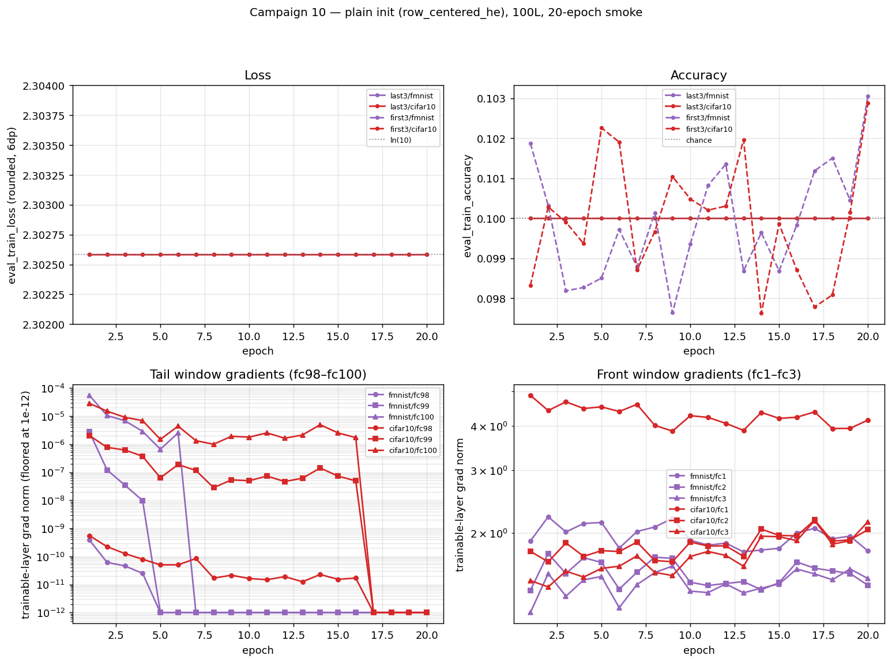

# 10 — rc frozen ends: where can trainable signal enter a deep row-centered net?

**Question.** At 100 layers with the **plainest row-centered initialization** (`row_centered_he` — He then subtract row means, no variance re-adjustment), train only the **last 3 layers** (hidden layers 99, 100 + the output head; everything else frozen) and, separately, only the **first 3 layers** (hidden layers 1, 2, 3; everything else, including the head, frozen at init). Advisor's bet: training is fast in both cases. Brief: [`docs/plans_handoffs/briefs/2026-07-17_campaign10-rc-frozen-ends.md`](../../docs/plans_handoffs/briefs/2026-07-17_campaign10-rc-frozen-ends.md).

**Builds on.** Campaign [09](../09_rcfwd_rescale/README.md) showed rcfwd's gradient conditioning is solvable in closed form, but representation content decays and hits chance by layer ≈25 in the row-centered family (per-layer probe chain). `row_centered_he` (this campaign, no GradRescale) has the raw, uncorrected gain pair from the gain-coupling lock: `g_fwd ≈ 0.826`, `g_bwd ≈ 1.0` per layer — forward signal shrinks by `0.826^97 ≈ 1e-8` over the depth between layer 3 and the head, while backward gradients traverse at roughly unit scale. This campaign asks, surgically: does trainable signal enter better through a **head sitting on that vanishingly small, content-dead representation** (`last3`), or through **early layers with full-content inputs but 97 frozen scrambling layers ahead of them** (`first3`)?

## Pre-registered predictions

- **Advisor's bet:** both conditions train fast.
- **Oracle's predictions (from campaign-09 data):** **last3** stuck at chance — the head sits on representations that are content-dead (probe: chance by ℓ≈25) *and* vanishingly small in scale (`0.826^97`). **first3** slow or stuck — gradients arrive at ~unit scale (`g_bwd≈1`) and the first layers sit on full-content inputs, but any learned change must survive 97 frozen scrambling layers forward before it reaches the loss. Divergence between these predictions and the outcomes is the finding.

## What ran

`run_rc_frozen_ends.py` — deliberately minimal so freezing-location (and, in the second pass, recipe) is the only variable: NoBN, width 500, depth 100, plain SGD lr 1e-2 (mom 0, wd 0, fixed LR), bs 256, seed 42, no clipping (assert-enforced), normalize inputs. Two recipes: `raw` (`row_centered_he`, no `grad_rescale` — the original pass) and `rcfwd` (`row_centered_forward_balanced` + `grad_rescale=r≈0.826`, campaign 09's exact corrected recipe — see §H1 vs H2 below). Matrix: 2 conditions (`first3`, `last3`) × 2 datasets (`fmnist`, `cifar10`) × 2 recipes (`raw`, `rcfwd`) × {smoke 20 ep, audit 200 ep} = 16 subs. Smoke logs per-layer gradients every epoch (`diagnostics_every=1`, `log_grad_per_layer=True`).

Freezing implementation: `ClassifierConfig.trainable_layers` ([config.py](../../src/rp_study/config.py)) — additive, default `None` (no behavior change to any existing experiment) — applied in `DeepFCClassifier._freeze_except` ([classifiers.py](../../src/rp_study/models/classifiers.py)) as `requires_grad=False` on the frozen Linear layers' weight/bias tensors. This does **not** use `torch.no_grad()` or detach activations, so backprop still runs through frozen layers unchanged — gradients keep flowing to earlier trainable layers via the input-grad path.

**`first3+head` variant flag (per brief):** the literal reading of the advisor's spec freezes the head in the `first3` condition. This is a natural asymmetry to double back on with the advisor — a `first3+head` run (head trainable in both conditions) is a one-line addition (`trainable_layers=["fc1","fc2","fc3","head"]`) if he intended the head trainable in both. Not run in this pass.

## Freeze-mechanics verification (local, CPU, before any cluster sync)

Per the brief's constraint, the freezing mechanism was verified locally before syncing:

- **Trainable-tensor count**: both conditions report exactly 6 trainable tensors (3 Linear layers × {weight, bias}) via `DeepFCClassifier.trainable_tensor_count()`, asserted at runner startup (printed in the banner) and matching `2 × len(trainable_layers)`.
- **Gradient flow**: after a backward pass, `grad_norm_per_layer` is nonzero *exactly* at the named trainable fc-layers and zero everywhere else — confirming freezing suppresses only the named layers' own parameter gradients, not backprop through them.
- **`first3` full backward path**: with the head frozen, the loss gradient still traverses all 97 frozen layers back down to fc1–fc3 without error (2-epoch CPU run on fashion_mnist, 512 train samples, completes; `status=completed`, no divergence).
- **`last3` numerical watch-item (predicted in the brief) confirmed early**: in the CPU dry run, `last3`'s trainable-layer gradients (fc99, fc100) sit at **1e-4 to 1e-8 scale**, consistent with the `0.826^97` forward-signal collapse reaching the head before any real training has happened.

Dry-run scripts are not committed (scratch); the assertions above are now load-bearing in `run_rc_frozen_ends.py`'s `main()` (trainable-tensor-count assert) and reproduced by any smoke run.

## Findings

**Both the advisor's bet and the "slow" half of the oracle's prediction are wrong — both conditions are flat-dead at 20 epochs, by two different mechanisms.** From `rcfrozen_{first3,last3}_smoke_{fmnist,cifar10}_100L.json`:

| Cell | ep1 → ep20 train acc | loss | trainable-layer grad norms | verdict |
|---|---|---|---|---|
| `last3`/fmnist | 0.1000 → 0.1000 (bit-exact) | 2.302585 (= ln 10, bit-exact, all 20 ep) | fc99,fc100: 1e-10–1e-6 @ ep1 → **exact float32 zero from ep3 on** | **DEAD** |
| `last3`/cifar10 | 0.1000 → 0.1000 (bit-exact) | 2.302585 (bit-exact, all 20 ep) | fc99,fc100: 1e-10–1e-7 @ ep1 → **exact float32 zero from ep8 on** | **DEAD** |
| `first3`/fmnist | 0.1019 → 0.1031 (noise) | 2.302585 (bit-exact, all 20 ep) | fc1–fc3: 1.2–2.2, stable, never vanishing | **STUCK** |
| `first3`/cifar10 | 0.0983 → 0.1029 (noise) | 2.302585 (bit-exact, all 20 ep) | fc1–fc3: 1.5–4.9, stable, never vanishing | **STUCK** |

(Verdict taxonomy from campaign 06's `triage_row_centered_smoke.py`: DEAD = grads at the numerical floor; STUCK = loss flat near initial despite live gradients.)



*Top row:* `eval_train_loss` (rounded to 6dp — the reported precision; raw values differ only in the 7th-8th decimal, ordinary float noise) and `eval_train_accuracy` for all four cells across the 20-epoch smoke — both bit-exact/pinned at `ln(10)` and chance respectively. *Bottom row:* the trainable-layer gradient norms that produce these two distinct flat lines — `last3`'s fc99/fc100 (left, log scale, floored at 1e-12 for display) collapse to exact float32 zero by epoch 3 (fmnist) / epoch 8 (cifar10); `first3`'s fc1-fc3 (right, log scale) stay in the healthy 1-5 range for all 20 epochs and never approach the numerical floor. Generated by [`scripts/rc_frozen_ends_plots.py`](../../scripts/rc_frozen_ends_plots.py) from the 4 smoke JSONs.

**`last3` confirms the oracle's prediction exactly, and sharper than predicted.** The trainable head's input sits on the `0.826^97 ≈ 1e-8`-scale forward signal (§Context), so its init-time gradient is already at the 1e-6–1e-10 floor (matches the local dry-run observation in the verification section above). Under 20 epochs of plain SGD that gradient does not recover — it shrinks *further* and hits exact float32 zero (not "very small", identically `0.0` in the logged tensor) within 3–8 epochs, after which the run is mathematically frozen: `0 × lr = 0` every step. `eval_train_accuracy` and `eval_train_loss` are bit-identical to `1/10` and `ln(10)` for all 20 epochs — the network is outputting an (effectively) uniform distribution the entire run, because the head's weights never move enough to matter.

**`first3` refutes the "slow" half of the oracle's prediction — it is not slow, it is stuck.** Unlike `last3`, the fc1–fc3 gradients are healthy and *never vanish*: order 1–5 in magnitude, stable across all 20 epochs (no float32 floor problem here — the input is full-scale, undamaged data). Despite ~4,700 SGD steps (fmnist, 20 ep × ~235 batches) actually updating these weights every step, `eval_train_loss` does not move even in the 6th decimal place — it is bit-identical to `ln(10)` at every logged epoch on both datasets. This is stronger than "slow": whatever fc1–fc3 learn about the input gets **completely absorbed** by the 97 frozen, never-updated downstream layers before it reaches the loss — consistent with the campaign-09 finding that row-centered forward maps at this depth sit at a content-dead fixed point, but sharpened here: even *targeted* representation changes at the very front of the network produce no detectable output-level effect through that fixed frozen stack, at least within the smoke horizon.

**Triage call: do not gate to audit.** Both conditions show zero epochs of measurable progress across the full smoke window — `last3` because its gradient literally reached zero, `first3` because 20 epochs (~4,700 steps) of live, non-vanishing gradient produced no loss movement at all (not even a slow decline masked by noise). Unlike campaign-09 cells that were promoted on partial, decaying-but-still-decreasing loss curves, there is no comparable signal here to extrapolate from. 200 more epochs cannot move `last3` (its gradient is identically zero) and there is no evidence-based reason to expect `first3` to behave differently at 200 epochs than at 20. Per the brief, none of the four cells is promoted to the 200-epoch audit; the four unused `.sub` files (`rcfrozen_*_audit_*_100L.sub`) remain available if the advisor wants a direct 200-epoch confirmation regardless.

**Answering the campaign question:** neither entry point trains — signal cannot productively enter a 100L plain-row-centered net through either the last three layers (content + scale both dead there) or the first three (content and scale are fine, but 97 untrained frozen layers downstream absorb any change before it reaches the loss). This sharpens Phase 6/campaign-09's "content, not conditioning, is the bottleneck" finding: it is not merely that *forward-propagated* content is dead at depth — the network's *insensitivity* extends to gradient-driven changes made anywhere in it, front or back, as long as the vast majority of the stack stays frozen at this initialization.

## H1 vs H2: does the raw-recipe failure indict the gradient rescale, or confirm content death?

This campaign was partly motivated by a live disagreement about *why* campaign 09 (rcfwd) needed its `grad_rescale` correction at all. Campaign 09's `row_centered_forward_balanced` init keeps the **forward** activation RMS flat by construction, but that flatness forces the **backward** gain to compound at `1/r ≈ 1.21` per layer — over ~100 layers the raw, uncorrected gradient would blow up by roughly `1.21^97`. `grad_rescale=r` is a fixed, depth-known multiplier (via the `_GradRescale` op: identity forward, `× r` in the backward pass) that cancels this exactly — it is *not* adaptive gradient-norm clipping (which this project forbids for training instability in general), but it is still an artificial correction to the raw gradient, and that raised a genuine question:

- **H1 (the advisor's worry):** the rescale might not just be conditioning the gradient's *scale* — by uniformly damping every layer's backward signal, it could be suppressing or redirecting a gradient that, left alone, points somewhere real and useful. Under H1, a much smaller-scope problem — training only 3 layers, where no whole-network rescale is even necessary — should be able to train fine on the **raw**, uncorrected init, since there's no long compounding chain for an artificial correction to distort.
- **H2 (the standing campaign-09 finding):** the real bottleneck is that row-centered representation *content* dies (linear-probe accuracy at chance by layer ≈25, per campaign 09's probe chain) — a forward-propagation fact that has nothing to do with backward gradient conditioning. Under H2, training only 3 layers should fail too, regardless of whether any rescale is applied, because the trainable layers either sit on already-dead forward content (`last3`) or feed into a downstream stack that will destroy whatever they learn (`first3`).

**The raw-recipe results above already discriminate against H1.** Neither failure mode is a gradient-direction/magnitude story: `last3` dies from forward-scale decay (`0.826^97`) reaching the head — a fact about the forward pass, present with or without any backward rescale. `first3`'s gradients are healthy and well-scaled (order 1–5, no correction needed, no rescale ever applied here) and *still* produce zero loss movement, because the 97 frozen downstream layers absorb the change. If H1 were the real story, `first3` in particular — no rescale in play, healthy gradients, full-content input — should have trained. It didn't.

**Direct follow-up, run as part of this campaign (not a separate one):** the same `first3`/`last3` frozen-layer design, rerun with campaign 09's *exact* corrected recipe — `row_centered_forward_balanced` init + `grad_rescale=r=sqrt((π−1)/π)≈0.826` — instead of raw `row_centered_he`. This isolates the rescale as the only changed variable. Two clean, falsifiable predictions:

- **If H1 is right:** the corrected recipe should let `last3` and/or `first3` train where the raw recipe didn't, because the "real" gradient is no longer being suppressed by depth-wide raw-gradient blowup dynamics that the frozen-3-layer raw setup never actually had in the first place.
- **If H2 is right:** both conditions should still fail to train — `last3` should no longer show the exact-float32-zero underflow signature (the rescale keeps backward gain at unit scale by construction), but should still show flat/negligible progress; `first3` should look qualitatively identical to the raw pass (healthy gradients, zero progress) since the rescale doesn't touch the forward pass or the content-death mechanism at all.

Local CPU dry runs (2 epochs, not conclusive, just a mechanics check) are consistent with H2 so far: under the corrected recipe, `last3`'s trainable-layer gradients are healthy (order 1.2–2.2, no underflow) rather than collapsing to zero, and `first3`'s loss does not stay pinned at `ln(10)` the way it does under the raw recipe — both expected under the rescale simply removing the raw-recipe's specific numerical failure signature, not the content-death mechanism itself. **Full 20-epoch smoke results pending** (4 new jobs: `rcfrozen_{first3,last3}_smoke_{fmnist,cifar10}_100L_rcfwd`, queued via the extended `run_rc_frozen_ends.py` — see Reproduce).

## Reproduce

```bash
cd ~/thesis   # after sync; clear __pycache__ first (config.py gained a new field)
for cond in first3 last3; do
  for ds in fmnist cifar10; do
    sbatch cluster/10_rc_frozen_ends/rcfrozen_${cond}_smoke_${ds}_100L.sub        # raw recipe, 2h each
    sbatch cluster/10_rc_frozen_ends/rcfrozen_${cond}_smoke_${ds}_100L_rcfwd.sub  # rcfwd recipe, 2h each
  done
done
# gate audits (6h each) on smoke triage:
# sbatch cluster/10_rc_frozen_ends/rcfrozen_<cond>_audit_<ds>_100L[_rcfwd].sub
```

Pull back with `bash cluster/pull_results.sh 'rcfrozen_*_smoke_*' 10_rc_frozen_ends`. Logs end with `SUMMARY <label> | PASS/fail | ...`.

## Evidence & gaps

- 4/8 `raw`-recipe jobs run and pulled: `rcfrozen_{first3,last3}_smoke_{fmnist,cifar10}_100L.json` in `reports/results/`, logs in `logs/slurm/10_rc_frozen_ends/`. All 4 completed cleanly (`status=completed`, `stop_reason=max_epochs`, no abort) with the trainable-tensor-count banner assert passing (`trainable tensors=6 (expect 6)`).
- **`rcfwd`-recipe follow-up (4 more smoke jobs) queued, not yet pulled** — `rcfrozen_{first3,last3}_smoke_{fmnist,cifar10}_100L_rcfwd.json`. Runner extension + local CPU mechanics check (2 epochs) done; cluster run pending. See §H1 vs H2 above.
- **Gap (by triage decision, not a blocker):** the 8 audit `.sub` files (200 ep, both recipes) were not submitted — smoke showed zero epochs of progress in all four `raw` cells (see Findings), so promoting them was not evidence-justified per the brief's gating rule. Available to run on explicit advisor call; the `rcfwd` audits are worth reconsidering once the `rcfwd` smoke verdicts land, in case that recipe shows genuine (if slow) learning.
- Cosmetic: the shared `print_diagnostic_summary` (from `cluster/03_he_diagnostics/run_diagnostic.py`) computes a min/max gradient-ratio banner assuming all layers are trainable; with most layers frozen (zero grad by construction) the printed ratio is a meaningless huge number (min=0 in the denominator) in the console log. Does not affect the saved JSON — only the printed console summary. Not fixed here since `run_diagnostic.py` is shared code outside this campaign's scope.
- The `first3+head` asymmetry flagged above is unconfirmed with the advisor — worth raising given `first3`'s result: even with the head trainable in `last3`, the head's own gradient underflowed to zero, so a `first3+head` variant would very likely die the same way `last3` did (head input is equally scale-dead regardless of which earlier layers are trainable). Low priority follow-up.
